  
# {{ $frontmatter.title }}

流程和前言中提到的安装 Ubuntu 相似，故本文只讲与在电脑上安装Ubuntu的区别。

## 安装 Rocky Linux 10.1
界面设计得有点奇怪。参考 https://linux.vbird.org/linux_server/rocky9/0120cloudandvm.php 的 1.1.3 节。

### 分区
在 Ubuntu 的基础上，需要另外建一个大约 1GB 的分区，挂载在 `/boot` 上，否则报错：“/boot 文件系统的类型不能为 lvmlv”。

挂载了`/boot`，还需要挂载`/boot/efi`吗？上面的参考网站提到了，要！因为是 UEFI 环境。参考图片：

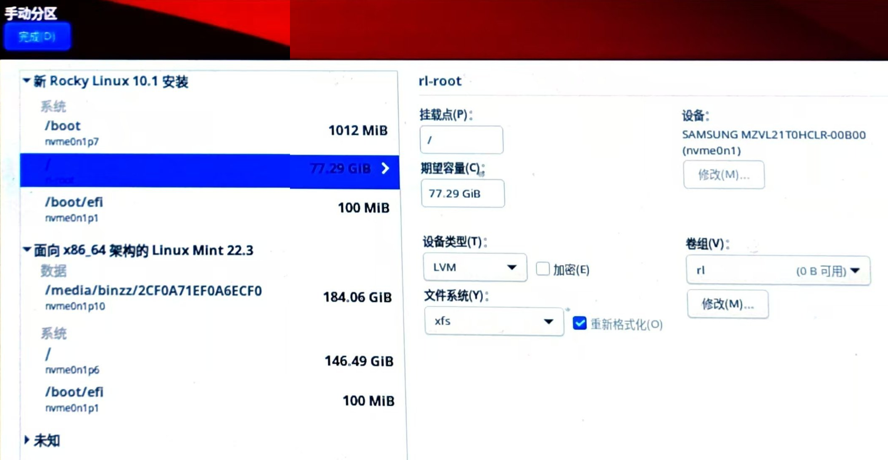
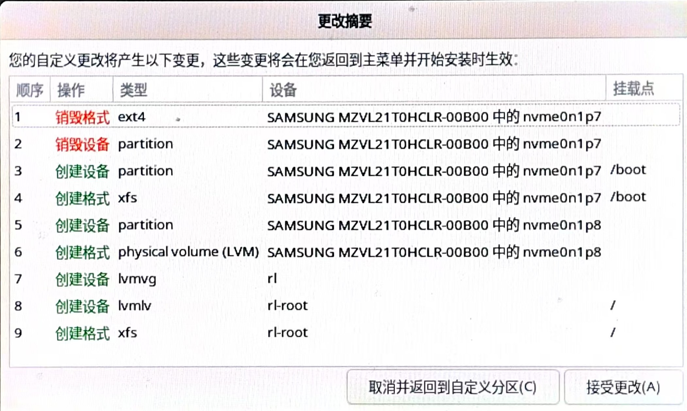

不过这样分区后，覆盖了 Mint 的引导项，导致 Mint 在启动时只能出现如下画面：
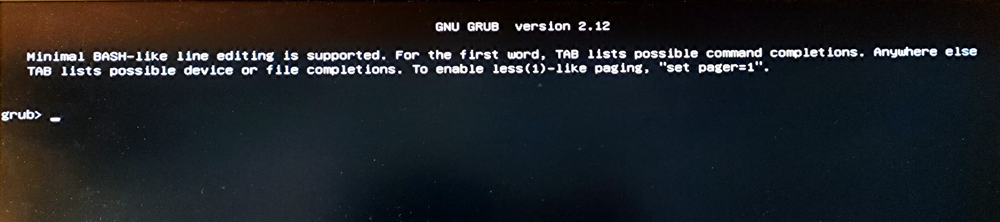
这是 GRUB 的救援模式。解决方法为，用 Live USB 启动一个临时系统，在终端上：
```bash
sudo su
mkdir /mnt/mint
mount /dev/nvme0n1p6 /mnt/mint
mount /dev/nvme0n1p1 /mnt/mint/boot/efi
mount --bind /sys /mnt/mint/sys
mount --bind /dev /mnt/mint/dev
mount --bind /proc /mnt/mint/proc
chroot /mnt/mint
grub-install
```
然后重启，进入了 Mint 的正常启动画面。其中包含GRUB，但发现没有 Rocky 的选项，需要执行`update-grub`。再次重启，就可以在 Mint 的 GRUB 中看到 Rocky 的选项了。

### 必备软件安装
#### epel-release
这是在 Rocky 上安装任何软件的基础。
```
sudo dnf install epel-release -y
```
#### ntfs-3g
如果要挂载 NTFS 分区，需要安装 `ntfs-3g`。
```bash
sudo wget -O /etc/yum.repos.d/epel.repo http://mirrors.aliyun.com/repo/epel-7.repo
sudo dnf install ntfs-3g
```


## Live USB 上 Mint 屏幕亮度过低 {#LiveUSB上LinuxMint屏幕亮度过低}
显然不能用安装显卡驱动解决，因为刚安装的显卡驱动在后重启才能生效，重启的话又是一个新的系统，丢失了数据。正确做法如下：

```bash
# 你的结果可能和我的不一样，这是因为你的显卡和我的不一样。
mint@mint:~$ ls /sys/class/backlight/
acpi_video0  amdgpu_bl2

# 比如我的CPU是AMD的，对应的文件夹是 amdgpu_bl2。
mint@mint:~$ ls /sys/class/backlight/amdgpu_bl2
actual_brightness  brightness  max_brightness  scale      type
bl_power           device      power           subsystem  uevent

# 这个文件记录了亮度的最大值。
mint@mint:~$ cat /sys/class/backlight/amdgpu_bl2/max_brightness 
255

# 在0到亮度最大值255之间调整亮度。这里设置为128。
mint@mint:~$ echo 128 | sudo tee /sys/class/backlight/amdgpu_bl2/brightness 
128
mint@mint:~$
```
刚安装的 Mint 也会出现屏幕亮度过低的情况，需要[安装显卡驱动](报错记录.md#ROS的Gazebo、Rviz等图形界面打不开})。

## Ubuntu WSL
Ubuntu WSL 是 Windows Subsystem for Linux 的一个版本，它允许你在 Windows 上运行 Linux 环境。安装 Ubuntu WSL 的步骤如下，可以先直接进行第4步，发现问题后再执行所有步骤。
1. 按下 `Win + R`，输入`msinfo32`查看系统信息，确保“基于虚拟化的安全性”处于正在运行而非关闭的状态。
    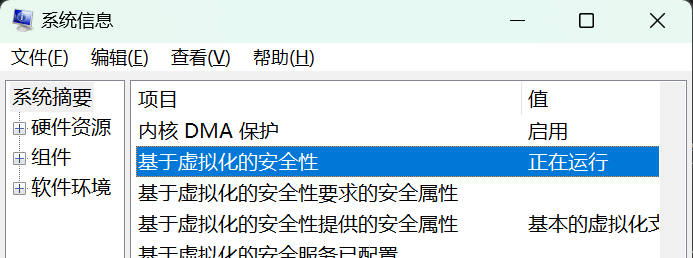
    如果是关闭的状态，请以管理员身份进入PowerShell，执行以下命令再重启计算机以打开：
    ```bash
    bcdedit /set hypervisorlaunchtype Auto
    ```
    然后重启计算机。
    相反，如果最后一个参数是off，则会有相反的效果，即关闭虚拟化，有助于提高性能，但会降低安全性、使得 WSL 和 Ubuntu WSL 无法正常运行。
2. 确保 WSL 功能已启用：
    ```bash
    wsl --install
    ```
    如果未启用，可以手动启用：
    ```bash
    dism.exe /online /enable-feature /featurename:Microsoft-Windows-Subsystem-Linux /all /norestart
    dism.exe /online /enable-feature /featurename:VirtualMachinePlatform /all /norestart
    ```
    然后重启计算机。
3. 更新 WSL：
    ```bash
    wsl --update
    ```
4. 查看WSL可安装的Linux发行版，并按指示进行安装，例如`wsl --install -d Ubuntu-24.04`。
    ```bash
    C:\Users\binzz>wsl --list --online
    以下是可安装的有效分发的列表。
    请使用“wsl --install -d <分发>”安装。

    NAME                            FRIENDLY NAME
    Ubuntu                          Ubuntu
    Debian                          Debian GNU/Linux
    kali-linux                      Kali Linux Rolling
    Ubuntu-18.04                    Ubuntu 18.04 LTS
    Ubuntu-20.04                    Ubuntu 20.04 LTS
    Ubuntu-22.04                    Ubuntu 22.04 LTS
    Ubuntu-24.04                    Ubuntu 24.04 LTS
    OracleLinux_7_9                 Oracle Linux 7.9
    OracleLinux_8_10                Oracle Linux 8.10
    OracleLinux_9_5                 Oracle Linux 9.5
    openSUSE-Leap-15.6              openSUSE Leap 15.6
    SUSE-Linux-Enterprise-15-SP6    SUSE Linux Enterprise 15 SP6
    openSUSE-Tumbleweed             openSUSE Tumbleweed

    C:\Users\binzz>
    ```

## VirtualBox 虚拟机
见韩会会的“实用软件分享”笔记。

##  使用树莓派
Raspberry Pi OS 基于 [Debian](https://www.debian.org/index.zh-cn.html)。
### 软件&网站
1. SD卡格式化工具：[SD Card Formatter](https://www.sdcard.org/downloads/formatter/sd-memory-card-formatter-for-windows-download/)。点击网页最下方的 Accept 按钮即可下载安装包。

2. NVC连接树莓派的工具：[VNC Viewer](https://www.realvnc.com/en/connect/download/viewer/?lai_vid=QXRmkExDvUK96&lai_sr=5-9&lai_sl=l)。这样就可以远程控制树莓派，不需要每次都插显示器和键盘了。

3. [Raspberry Pi OS的光盘映像烧录程序](https://www.raspberrypi.com/software/) 

4. Raspberry Pi OS 光盘映像站，有[官方](https://www.raspberrypi.com/software/operating-systems/
)和[清华源](https://mirrors.tuna.tsinghua.edu.cn/help/raspbian/)

5. Raspberry Pi [官方文档](https://www.raspberrypi.com/documentation/) 和 [引脚图](https://pinout.xyz/)

### 安装并进入 Raspberry Pi OS
1. 安装 Raspberry Pi OS的光盘映像烧录程序，打开，界面如下。
    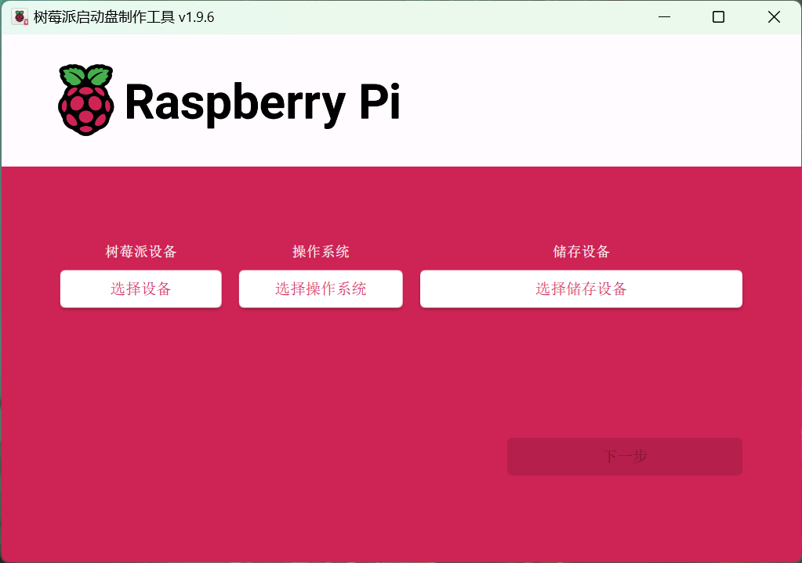
2. 将SD卡插入USB读卡器，再将读卡器插入电脑的USB接口，完成烧录程序的“选择设备”“选择操作系统”“选择存储设备”三项，点击“下一步”, 选择“编辑设置”。
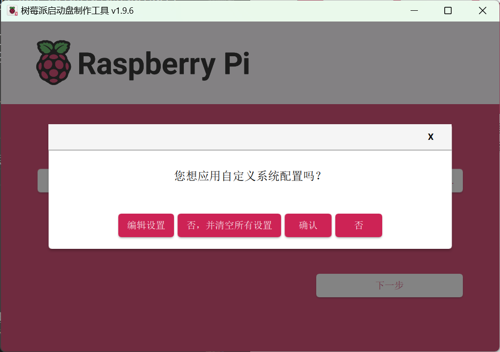
3. 自定义系统配置，如下：
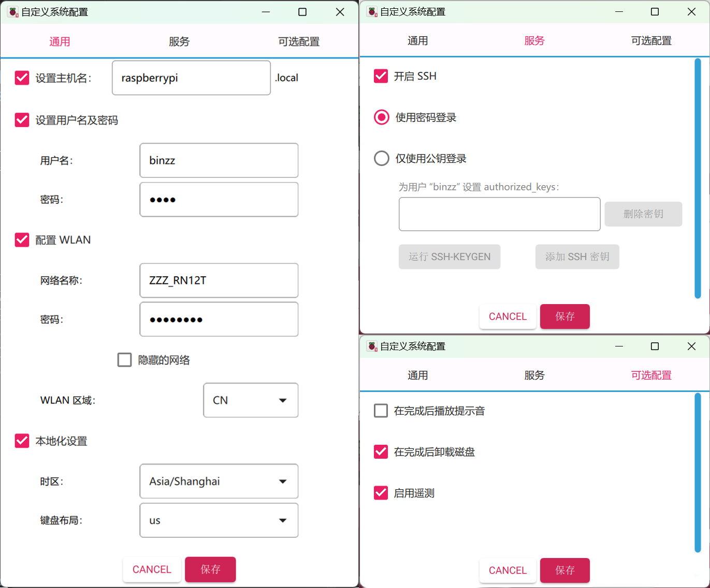
    - **配置WLAN**：这是一会儿新的 Raspberry Pi OS 系统启动后，自动连接到的网络，以便通过 NVC、SSH 等方式远程控制树莓派。一定要选择  Raspberry Pi 连接这个网络后，你可以找到 Raspberry Pi 的 IP 地址的网络，否则无法进行 NVC 或 SSH 连接。
    - **开启SSH**：这个一定要勾选。
    配置完后选择“保存”，应用自定义系统配置。
4. 选择“确认”，耐心等待光盘映像烧录完成。
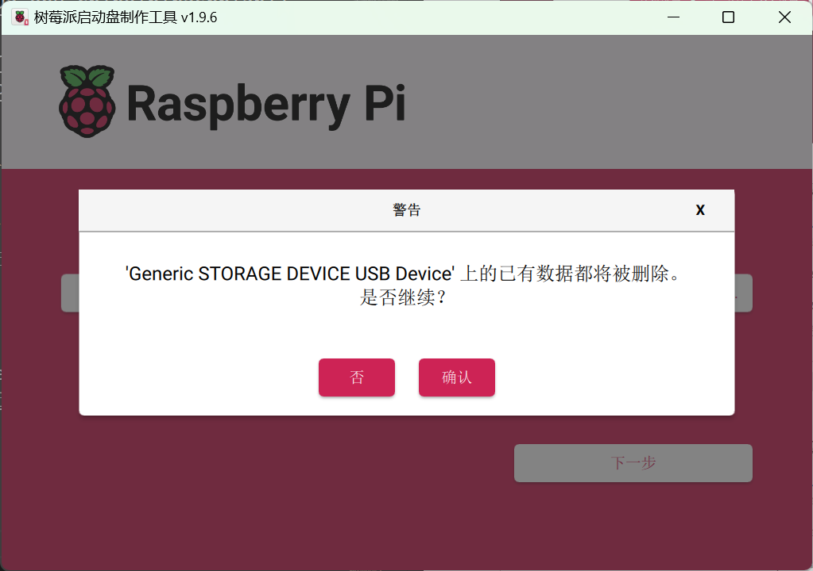
5. 将烧录好光盘映像的SD卡插入 Raspberry Pi，上电，用 SSH 连接到树莓派，执行`sudo raspi-config`，选择`Interfacing Options` -> `VNC`，开启VNC服务。
    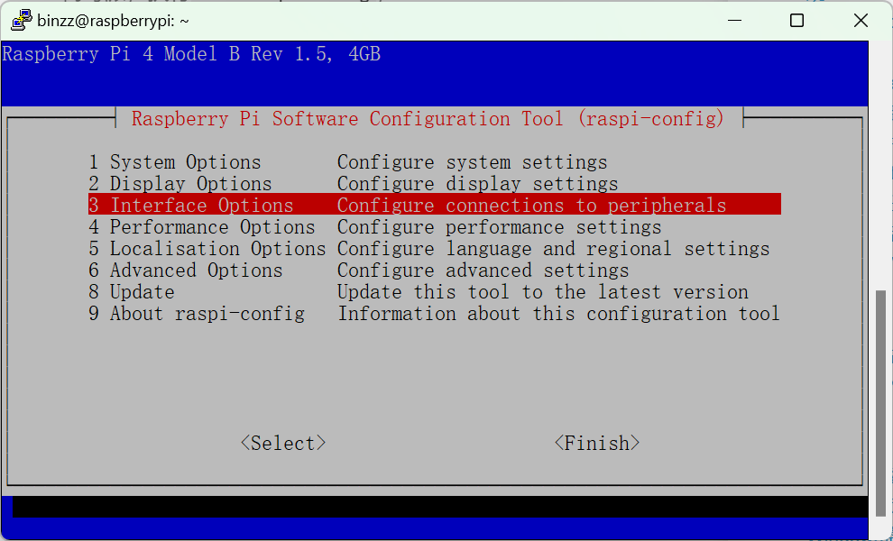
    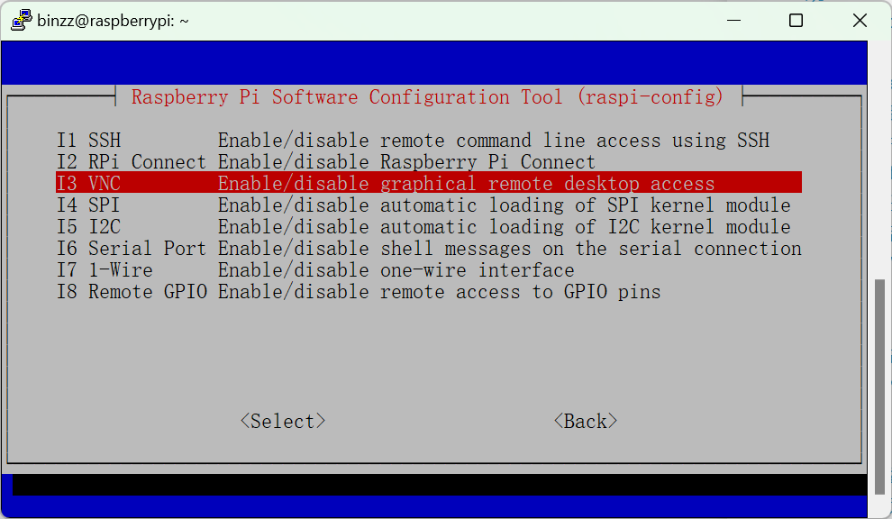

6. 打开 RealVNC Viewer，选择 File -> New Connection，输入 Raspberry Pi 的 IP 地址，点击 OK，然后输入用户名和密码，选择 Remember password，即可远程控制树莓派。
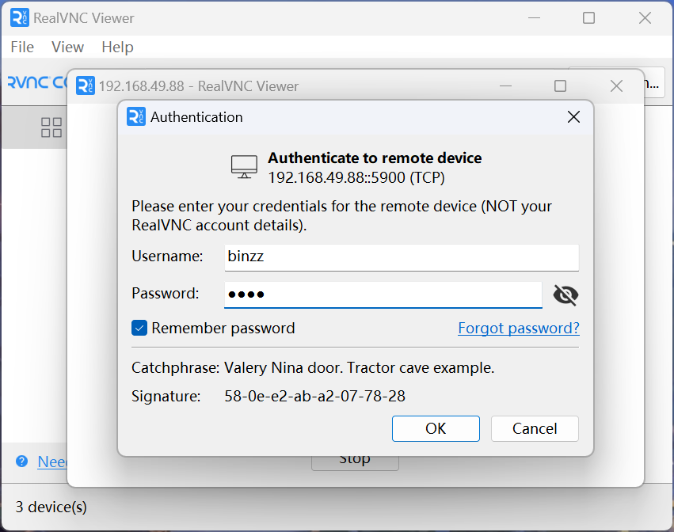
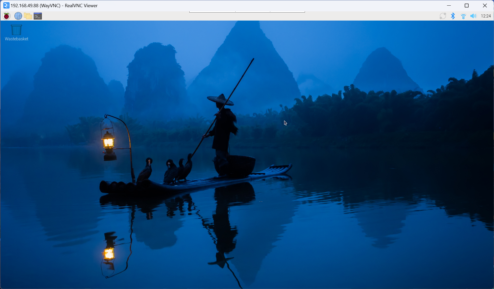

### 汉化
#### 安装中文输入法
```bash
sudo apt install fcitx5 fcitx5-chinese-addons
```
然后在GUI中设置吧！参考[官网](https://fcitx-im.org/wiki/Fcitx_5/zh-cn#%E7%94%A8%E6%88%B7)。
#### 语系改为中文
1. 执行`sudo raspi-config`，选择`Localisation Options` -> `Locale`，选择`zh_CN.UTF-8 UTF-8`（要用空格键选择），然后选择`OK`，最后选择`Finish`。
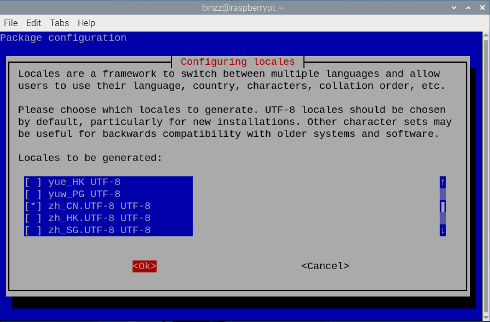
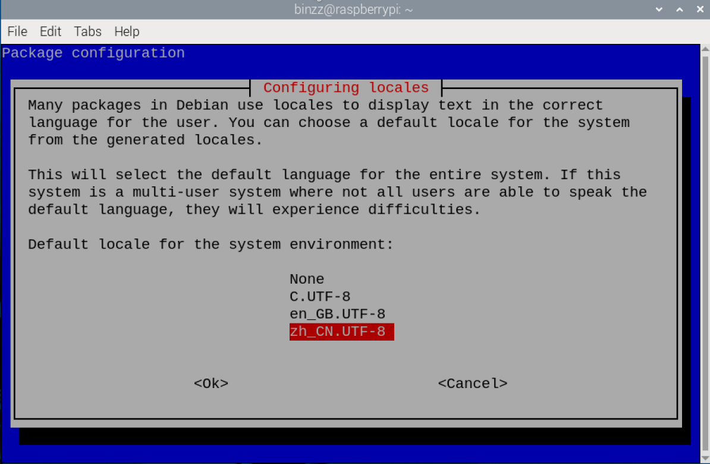
2. 重启，看到了中文界面。
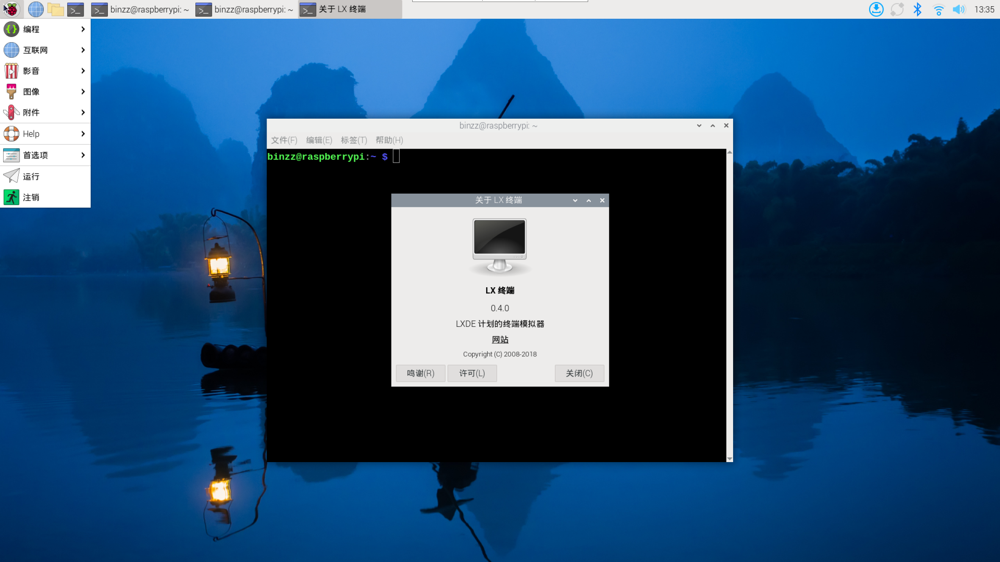


## 在香橙派上开启 VNC 服务
### 1️⃣ 安装 VNC 服务端
在 Orange Pi 上：

```bash
sudo apt install tigervnc-standalone-server tigervnc-common -y
```

* `tigervnc-standalone-server` → VNC 服务端
* `tigervnc-common` → 通用配置文件和工具

### 2️⃣ 设置 VNC 密码

```bash
vncpasswd
```

* 输入你希望连接 VNC 的密码（至少 6 位）
* 会提示是否设置只读密码（选否）


### 3️⃣ 启动 VNC 服务生成配置文件

```bash
vncserver
```

* 这个命令会生成 `~/.vnc/` 目录和一些默认配置文件（包括 `xstartup`）
* 日志会在 `~/.vnc/orangepi5:<显示号>.log`

**注意**：第一次启动可能会自动选择 `:1` 或 `:2` 作为显示号。


### 4️⃣ 配置桌面环境启动脚本

TigerVNC 启动时，会读取 `~/.vnc/xstartup` 来决定启动哪种桌面。

#### 常见问题

* `Segmentation fault` 或者 `Failed command '/home/orangepi/.vnc/xstartup'`
* `xrdb: can't open file '/home/orangepi/.Xresources'`

⚠️ 原因：`xstartup` 没写好桌面启动命令或者系统没桌面环境。

#### 修复

1. 打开 `xstartup`：

```bash
nano ~/.vnc/xstartup
```

2. 内容改为（假设你用 XFCE 桌面）：

```sh
#!/bin/sh
unset SESSION_MANAGER
unset DBUS_SESSION_BUS_ADDRESS

xrdb $HOME/.Xresources
startxfce4 &
```

3. 给执行权限：

```bash
chmod +x ~/.vnc/xstartup
```

4. 杀掉之前启动的 VNC：

```bash
vncserver -kill :1
vncserver -kill :2
```

### 5️⃣ 允许外部访问（不是只在本机）

默认 VNC 只监听 `127.0.0.1`，也就是只能在 Orange Pi 本机访问。

* 临时方法：加上`-localhost no`参数

```bash
vncserver :1 -localhost no
```

* 查看监听：

```bash
ss -tlnp | grep 5901
```

输出应该是 `0.0.0.0:5901` 才能让 Windows 或其他电脑访问。

* 防火墙允许：

```bash
sudo ufw allow 5901/tcp
```

### 6️⃣ Windows 端连接

* RealVNC Viewer 输入：
```
<OrangePi局域网IP>:5901
```

> 注意：`5901 = 5900 + 显示号`，`:1` 就是 5901，`:2` 就是 5902

* 如果输入只写 IP，不带端口，可能连接失败。

### 7️⃣ 开机自启

使用 systemd 模板服务文件：

1. 创建服务文件：

```bash
sudo nano /etc/systemd/system/vncserver@:1.service
```

2. 内容：

```ini
[Unit]
Description=TigerVNC Server for %i
After=syslog.target network.target

[Service]
Type=forking
User=orangepi
PAMName=login
PIDFile=/home/orangepi/.vnc/%H%i.pid
ExecStartPre=-/usr/bin/vncserver -kill %i > /dev/null 2>&1
ExecStart=/usr/bin/vncserver %i -localhost no
ExecStop=/usr/bin/vncserver -kill %i

[Install]
WantedBy=multi-user.target
```

⚡ 说明：

* `%i` → 启动时 `@1` 的数字，会自动替换成显示号
* `-localhost no` → 保证外部可以访问

3. 重新加载 systemd 并启用：

```bash
sudo systemctl daemon-reload
sudo systemctl enable vncserver@:1.service
sudo systemctl start vncserver@:1.service
```

4. 检查状态：

```bash
systemctl status vncserver@:1.service
```


### ✅ 总结流程

1. 安装 VNC 服务端
2. 设置密码
3. 启动生成配置文件
4. 配置 `xstartup` 启动 XFCE
5. 确认监听所有 IP（`-localhost no`）
6. Windows 用 `IP:5901` 连接
7. 配置 systemd 开机自启
