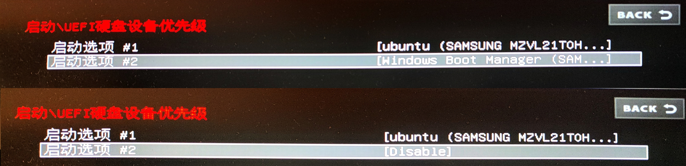

  
# {{ $frontmatter.title }}


如果频繁安装和删除多个操作系统，就不得不好好理解多重引导的原理。

在[前言](index.md)说过，电脑启动时，软件控制权首先给BIOS/UEFI，再给在BIOS/UEFI所选择的引导项。

同样是菜单选择的样子，BIOS/UEFI管的是这个：

而GRUB管的是这个：


如果引导项对应的系统的启动程序是GRUB，那么该系统的GRUB就会运行。Linux Distributions 的默认启动程序是 GRUB。Windows 的启动程序是 Windows Boot Manager 而非 GRUB。

本文以硬盘的分区表是 GPT，BIOS 的模式为 UEFI 的情况进行说明。UEFI是一种更高级的BIOS。

# UEFI
决定 UEFI 引导项的是硬盘的 EFI System Partition（ESP），在 Linux Distribution 中被挂载为 `/boot/efi`。
```bash
binzz@C7VF:~$ lsblk -o NAME,SIZE,TYPE,FSTYPE,MOUNTPOINT,PARTTYPENAME /dev/nvme0n1
NAME           SIZE TYPE FSTYPE MOUNTPOINT                    PARTTYPENAME
nvme0n1      953.9G disk                                      
├─nvme0n1p1    100M part vfat   /boot/efi                     EFI System
├─nvme0n1p2     16M part                                      Microsoft reserved
├─nvme0n1p3  220.2G part ntfs                                 Microsoft basic data
├─nvme0n1p4    812M part ntfs                                 Windows recovery environment
├─nvme0n1p5  323.9G part ntfs                                 Microsoft basic data
├─nvme0n1p6  146.5G part ext4   /                             Linux filesystem
├─nvme0n1p7   78.3G part ext4                                 Linux filesystem
└─nvme0n1p10 184.1G part ntfs   /media/binzz/2CF0A71EF0A6ECF0 Microsoft basic data

binzz@C7VF:~$ sudo tree /boot/efi/ -L 2
/boot/efi/
├── EFI
│   ├── Boot
│   ├── Microsoft   # UEFI的一个引导项
│   └── ubuntu      # UEFI的一个引导项
└── System Volume Information

6 directories, 0 files
```
这样看引导项很麻烦，需要`efibootmgr`的帮助了！
```bash
binzz@C7VF:~$ sudo efibootmgr
BootCurrent: 0002   # 本次进入当前系统所选择的引导项编号
Timeout: 1 seconds  # UEFI显示时间，单位秒
BootOrder: 0003,0002,0000   # 引导项显示顺序
Boot0000* Windows Boot Manager	HD(1,GPT,a5abc4a7-4e4c-417c-a0a6-f394f6d07765,0x800,0x32000)/File(\EFI\Microsoft\Boot\bootmgfw.efi)57494e444f5753000100000088000000780000004200430044004f0042004a004500430054003d007b00390064006500610038003600320063002d0035006300640064002d0034006500370030002d0061006300630031002d006600330032006200330034003400640034003700390035007d00000032000100000010000000040000007fff0400
Boot0002* Ubuntu	HD(1,GPT,a5abc4a7-4e4c-417c-a0a6-f394f6d07765,0x800,0x32000)/File(\EFI\ubuntu\shimx64.efi)
Boot0003* UEFI:  USB, Partition 2	PciRoot(0x0)/Pci(0x8,0x1)/Pci(0x0,0x4)/USB(2,0)/USB(0,0)/HD(2,MBR,0xba7a775e,0xe522000,0x10000)0000424f
```
## 修改引导项顺序
```bash
sudo efibootmgr -o 0002,0000,0003
```
## 删除残余引导项
我以前安装了 Rocky Linux，当时它新建了一个引导项叫做 `Rocky Linux`，编号是 0001，对应了 `/boot/efi/EFI/rocky/` 目录。
现在把它删掉了，但它的引导项还有残留，在 UEFI 上还能看到。解决方法为：
```bash
sudo efibootmgr -b 0001 -B
sudo rm -rf /boot/efi/EFI/rocky/
```
## 激活/禁用引导项
在 UEFI 设置中，不仅可以调节引导项的优先级，还可以激活或禁用引导项

每种型号的电脑的 UEFI 设置界面都不同，但使用 `efibootmgr` 命令是通用的。例如，禁用 Windows Boot Manager：
```bash
sudo efibootmgr -b 0000 -A
```
激活 Windows Boot Manager：
```bash
sudo efibootmgr -b 0000 -a
```
理论上在UEFI界面应该能看到相应的更改，但我没看到，连这些禁用/激活的命令都不能正常运行。


# GRUB
GRUB 是 GNU GRand Unified Bootloader 的缩写，是一个用于引导操作系统的软件。GRUB 可以在多个操作系统之间进行选择，也可以作为启动菜单。

GRUB 的配置文件是 `/etc/grub.d/` 目录下的脚本文件。每个脚本文件对应一个引导项。GRUB 的配置文件是一个文本文件，使用 Bash 语法。

## 修复引导项：`grub-install` 和 `update-grub`
### `grub-install`：安装引导阶段 (The Installer)
`grub-install`将 GRUB 的核心执行文件物理地写入磁盘的特定位置，并建立它与 BIOS/UEFI 固件之间的联系。

* **改变了哪些文件/位置？**
    * **磁盘首部 (MBR/GPT)：** 在旧式 BIOS 模式下，它会改写磁盘的第一个扇区（MBR）或其后续的保留扇区。
    * **EFI 系统分区 (ESP)：** 在 UEFI 模式下，它会将 `.efi` 引导文件复制到 `/boot/efi/EFI/[distro]/` 目录下。
    * **NVRAM：** 它会调用 `efibootmgr` 将引导项注册进主板的 CMOS/NVRAM 中，这样你开机按 F12 才能看到启动项。
    * **`/boot/grub/`：** 它会将各种模块（`.mod` 文件，用于支持不同的文件系统）从系统目录复制到这里。

它解决的是 **“连 GRUB 界面都看不见”** 的问题（例如报错 `GRUB Rescue` 或直接跳进 BIOS）。它不关心你装了几个系统，它只负责让电脑能运行 GRUB 这个程序。

### `update-grub`：配置生成阶段 (The Configurator)
`update-grub`本质上是一个脚本，实际上运行的是 `grub-mkconfig -o /boot/grub/grub.cfg`。它的任务是探测当前电脑里有哪些操作系统，并写成一份“说明书”。

* **改变了哪些文件？**
    * **`/boot/grub/grub.cfg`：** 这是它的**核心产物**。这是一个复杂的脚本文件，决定了你开机看到的那个紫色/黑色菜单里有哪些选项。
* **它是如何工作的？**
    1.  读取 `/etc/default/grub` 中的用户设置（如等待时间 `TIMEOUT`）。
    2.  扫描 `/etc/grub.d/` 文件夹下的脚本模板。
    3.  调用 `os-prober` 工具去探测其他分区上的 Windows 或其他 Linux 核心。
    4.  将以上所有信息汇总，生成最终的 `grub.cfg`。

它解决的是 **“能进 GRUB 界面，但菜单里没有我要的系统”** 的问题。

### 总结对比表
| 特性 | `grub-install` | `update-grub` |
| :--- | :--- | :--- |
| **主要目的** | 将引导代码写入硬件/EFI分区 | 更新启动菜单内容 |
| **操作对象** | 磁盘扇区、EFI分区、主板NVRAM | `/boot/grub/grub.cfg` 配置文件 |
| **触发场景** | 更换硬盘、重装系统、引导丢失 | 内核更新、安装了双系统 |
| **执行频率** | 极低（一生可能就几次） | 高（每次更新系统内核后自动触发） |

我该用哪个？

* **如果你开机提示 `No bootable device` 或直接进入了 `grub rescue>` 命令行：**
    你需要 `grub-install`。你需要重新建立引导程序与硬件的连接。
* **如果你能看到 GRUB 菜单，但里面少了刚装的 Windows 或旧的内核：**
    你只需要 `update-grub`。引导程序没坏，只是它不知道新的系统在哪里。

> **小贴士：** 在修复模式（chroot）下，通常的顺序是先 `grub-install` 确保程序在位，再 `update-grub` 确保菜单正确。


## 引导权争夺
一台单硬盘（`nvme0n1`）、单ESP的电脑同时安装了 Linux Mint 和 Ubuntu，其ESP挂载在两个系统的`/boot/efi`目录下。`nvme0n1p6`是
Linux Mint 的根分区（挂载点是 `/`），`nvme0n1p7`是Ubuntu的根分区，所以两个系统的`/boot`对应的磁盘分区不同。请问电脑开机，选择引导项 ubuntu 后，运行的到底是 Ubuntu 的 grub 还是 Linux Mint 的 grub？

这就是引导权争夺的问题了。答案是，使用的是**最后一次执行 `grub-install`的那个系统**的 GRUB。

我记不住是哪个系统了，可以这样查询：
```bash
binzz@C7VF:~$ lsblk -f /dev/nvme0n1
NAME         FSTYPE FSVER LABEL UUID                                 FSAVAIL FSUSE% MOUNTPOINTS
nvme0n1                                                                             
├─nvme0n1p1  vfat   FAT32       7C91-02B7                              63.4M    34% /boot/efi
├─nvme0n1p2                                                                         
├─nvme0n1p3  ntfs               603CB3133CB2E2E8                                    
├─nvme0n1p4  ntfs               B4F23614F235DAF6                                    
├─nvme0n1p5  ntfs               8274ABEF74ABE45F                                    
├─nvme0n1p6  ext4   1.0         a2745656-391a-402b-827d-6a54934e77b2   81.5G    38% /
├─nvme0n1p7  ext4   1.0         655aee85-b98f-4812-9064-82647592e2b7                
└─nvme0n1p10 ntfs               2CF0A71EF0A6ECF0                      141.1G    23% /media/binzz/2CF0A71EF0A6ECF0
binzz@C7VF:~$ sudo cat /boot/efi/EFI/ubuntu/grub.cfg   
search.fs_uuid a2745656-391a-402b-827d-6a54934e77b2 root 
set prefix=($root)'/boot/grub'
configfile $prefix/grub.cfg
binzz@C7VF:~$ 
```
对照 UUID，发现使用的是 Linux Mint 的 GRUB。

如果想由 Ubuntu 掌管引导，就去 Ubuntu 系统内执行 `grub-install /dev/nvme0n1`吧！


# `/boot/`目录详解 {#boot}
```bash
# 看目录
binzz@C7VF:/boot$ ls -al | egrep "^d" | awk '{print $9}' | egrep -v "^\.{1,2}$" 
efi
grub
# 看文件
binzz@C7VF:/boot$ ls -al | egrep "^-" | awk '{print $9}' 
config-6.14.0-33-generic
config-6.14.0-36-generic
initrd.img-6.11.0-17-generic
initrd.img-6.14.0-33-generic
initrd.img-6.14.0-36-generic
memtest86+ia32.bin
memtest86+ia32.efi
memtest86+x64.bin
memtest86+x64.efi
System.map-6.14.0-33-generic
System.map-6.14.0-36-generic
vmlinuz-6.14.0-33-generic
vmlinuz-6.14.0-36-generic
binzz@C7VF:/boot$ 
```
1. **内核相关文件**

    - **vmlinuz 文件**
        - `vmlinuz-6.14.0-36-generic` - 压缩的 Linux 内核可执行文件
        - `vmlinuz-6.14.0-33-generic` - 旧版本内核
        - `vmlinuz -> vmlinuz-6.14.0-36-generic` - 指向当前内核的符号链接
        - `vmlinuz.old -> vmlinuz-6.14.0-33-generic` - 指向之前内核的符号链接

    - **initrd 文件** (初始 RAM 磁盘)
        - `initrd.img-6.14.0-36-generic` - 临时根文件系统，用于启动过程中加载必要的驱动和模块
        - `initrd.img-6.14.0-33-generic` - 旧版本的 initrd
        - `initrd.img -> initrd.img-6.14.0-36-generic` - 当前 initrd 的符号链接
        - `initrd.img.old -> initrd.img-6.14.0-33-generic` - 之前 initrd 的符号链接

    - **System.map 文件**
        - `System.map-6.14.0-36-generic` - 内核符号表，包含内核函数和变量的内存地址
        - `System.map-6.14.0-33-generic` - 旧版本的内核符号表

    - **config 文件**
        - `config-6.14.0-36-generic` - 内核编译时的配置选项
        - `config-6.14.0-33-generic` - 旧版本的内核配置

2. **引导加载程序目录**
    - **grub/ 目录**
        - 包含 GRUB2 引导加载程序的配置文件、主题和模块
        - `grub.cfg` 是主要的配置文件，由 `update-grub` 命令自动生成
    - **efi/ 目录**
        - 用于 UEFI 系统启动的 EFI 可执行文件
        - 包含 EFI 系统分区相关文件

3. **内存测试工具**
    - **memtest86+ 文件**
        - `memtest86+ia32.bin` - 32位内存测试工具
        - `memtest86+ia32.efi` - 32位 UEFI 版本内存测试
        - `memtest86+x64.bin` - 64位内存测试工具  
        - `memtest86+x64.efi` - 64位 UEFI 版本内存测试
        - 用于检测计算机内存硬件问题
4. 重要说明
    - 这个系统安装了多个内核版本（6.14.0-33 和 6.14.0-36），这提供了内核更新失败时的回退选项
    - 符号链接（`vmlinuz`, `vmlinuz.old`, `initrd.img`, `initrd.img.old`）确保引导加载程序总是使用正确的文件
    - 当安装新内核时，旧的 `.old` 链接会自动更新，保留前一个可工作的内核版本

    这种结构确保了系统的可靠启动和内核更新的安全性。

## `efi/` {#boot-efi}
```bash
binzz@C7VF:/boot$ tree efi/ -L 3
efi/
├── EFI
│   ├── Boot
│   │   ├── bootx64.efi
│   │   ├── fbx64.efi
│   │   └── mmx64.efi
│   ├── Microsoft
│   │   ├── Boot
│   │   └── Recovery
│   └── ubuntu
│       ├── BOOTX64.CSV
│       ├── grub.cfg
│       ├── grubx64.efi
│       ├── mmx64.efi
│       └── shimx64.efi
└── System Volume Information

8 directories, 8 files
binzz@binzz-Alpha-17-C7VF:/boot$
```
值得讲的是`.efi`和`.cfg`文件。
- `.efi` 文件
    - `bootx64.efi` - 引导加载程序的主可执行文件
    - `fbx64.efi` - 用于启动系统的 fallback 引导加载程序
    - `mmx64.efi` - 内存测试工具
    - `grubx64.efi` - GRUB2 引导加载程序的可执行文件
    - `shimx64.efi` - UEFI 引导加载程序的 shim 版本
- `.cfg` 文件
    - `grub.cfg` - GRUB2 引导加载程序的配置文件

`EFI/Microsoft/`的结构过于复杂，这里不展开讲。

## `grub/` {#boot-grub}
```bash
binzz@C7VF:/boot$ tree grub/ -L 1
grub/
├── fonts/
├── grub.cfg
├── grubenv
├── locale/
├── unicode.pf2
└── x86_64-efi/

4 directories, 3 files
binzz@C7VF:/boot$ 
```
- `fonts/` 目录
    - 包含 GRUB2 引导加载程序的字体文件
- `grub.cfg` 文件
    - GRUB2 引导加载程序的配置文件
- `grubenv` 文件
    - 包含 GRUB2 引导加载程序的环境变量
- `locale/` 目录
    - 包含 GRUB2 引导加载程序的本地化文件
- `unicode.pf2` 文件
    - 包含 GRUB2 引导加载程序的 Unicode 字体文件
- `x86_64-efi/` 目录
    - 包含 GRUB2 引导加载程序的 EFI 模块，有许多`.mod`文件

## 我可以修改哪些文件？
如果要对启动项进行修改，可以用其他方式，但**绝对不要手动修改`/boot`里面的任何文件！！！** 哪怕是里面的配置文件也不行，例如`/boot/grub/grub.cfg`，会由`update-grub`命令自动生成。
✅ 下面是针对启动项而言，相对安全的修改。

### 1. GRUB 配置文件
```bash
# 可以编辑 GRUB 主配置文件（但建议通过特定方式）
sudo nano /etc/default/grub

# 常用选项
# GRUB_DISABLE_OS_PROBER=false      # 禁用自动探测其他操作系统，默认是true。如果有其他操作系统，建议设置为false
# GRUB_TIMEOUT_STYLE=hidden         # 隐藏启动菜单，直接启动默认项。如果要显示，请设置为menu
# GRUB_BACKGROUND="/path/to/image"  # 启动菜单背景
# GRUB_TIMEOUT=10                   # 启动菜单显示时间
# GRUB_DEFAULT=0                    # 默认启动项索引
# GRUB_CMDLINE_LINUX_DEFAULT=""     # 内核启动参数

# 修改后，运行 sudo update-grub 自动生成 /boot/grub/grub.cfg
```
### 2. 更新内核
```bash
# 通过包管理器，不要手动替换
sudo apt update && sudo apt upgrade
```
### 3. 管理 initrd
```bash
# 如果需要重建 initrd，使用官方工具
sudo update-initramfs -u -k all
```
### 4. 创建自定义启动项
```bash
sudo nano /etc/grub.d/40_custom
```
添加内容示例：
```bash
menuentry "My Custom Boot" {
    set root=(hd0,1)
    chainloader +1
}
```
然后运行：
```bash
sudo update-grub
```
### 5. 清理旧内核文件：
```bash
# 使用自动清理工具
sudo apt autoremove --purge

# 或使用专门工具
sudo apt purge linux-image-旧版本号
```

