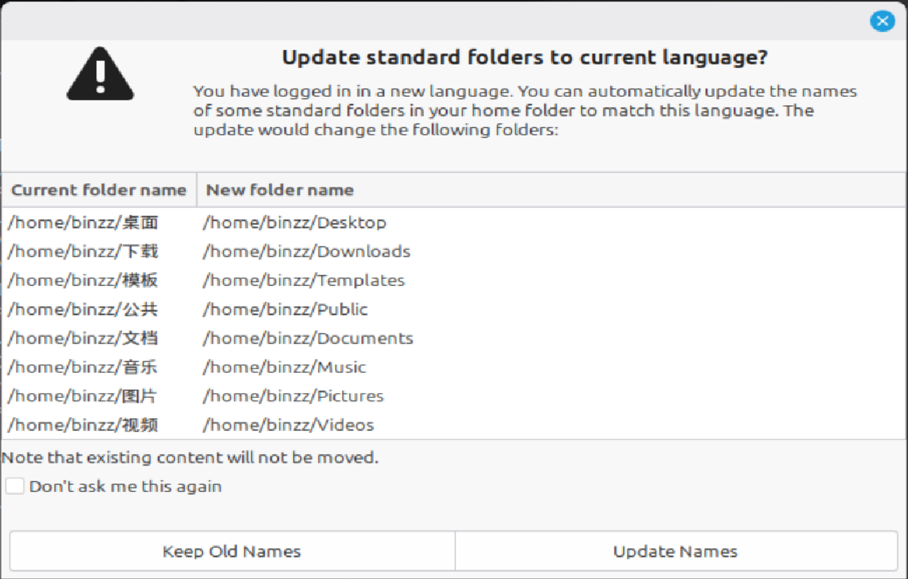

# {{ $frontmatter.title }}

家目录的桌面、文档等目录（如下图），在 Linux 中的专业叫法就是 **XDG 用户目录**，遵循 [FreeDesktop 标准](https://www.freedesktop.org/wiki/)。


## 设置英文路径
为什么想将 XDG 用户目录设为英文？一是有些程序或工具不支持中文路径，比如 PyQt5 的 QtWebEngine，加载不出中文路径的网页。二是英文路径输入起来更方便。
### 用户级
修改`~/.config/user-dirs.dirs`文件的内容如下。
```bash                    
# This file is written by xdg-user-dirs-update
# If you want to change or add directories, just edit the line you're
# interested in. All local changes will be retained on the next run.
# Format is XDG_xxx_DIR="$HOME/yyy", where yyy is a shell-escaped
# homedir-relative path, or XDG_xxx_DIR="/yyy", where /yyy is an
# absolute path. No other format is supported.
# 
XDG_DESKTOP_DIR="$HOME/Desktop"
XDG_DOWNLOAD_DIR="$HOME/Downloads"
XDG_TEMPLATES_DIR="$HOME/Templates"
XDG_PUBLICSHARE_DIR="$HOME/PublicShare"
XDG_DOCUMENTS_DIR="$HOME/Documents"
XDG_MUSIC_DIR="$HOME/Music"
XDG_PICTURES_DIR="$HOME/Pictures"
XDG_VIDEOS_DIR="$HOME/Videos"
```
修改家目录的桌面、文档等目录为对应的英文：
```bash
mv ~/桌面 ~/Desktop
mv ~/下载 ~/Downloads
mv ~/模板 ~/Templates
mv ~/公共 ~/PublicShare
mv ~/文档 ~/Documents
mv ~/音乐 ~/Music
mv ~/图片 ~/Pictures
mv ~/视频 ~/Videos
```
重新登入系统即可。

#### 可以尝试的方法
```bash
export LANG=en_US.UTF-8 # 或 export LANGUAGE=en_US.UTF-8
xdg-user-dirs-gtk-update
```
会弹出一个窗口，询问是否更新 XDG 用户目录。不要勾选“Don't ask me this again”，否则后续再想将更改 XDG 用户目录的语言时，该方法会失效。



但如果不勾选的话，每次登入系统都会弹出这个窗口，问你要不要把目录改回中文，为了防止这一点，请将 `/etc/xdg/user-dirs.conf` 中的 `enabled` 的值设为 `False`。

该方法的好处是不用手动给目录重命名，本质上就是修改了 `~/.config/user-dirs.dirs` 和 `~/.config/user-dirs.locale` 文件。

### 系统级
对目前存在的其他用户是不可以的，不过可以对新用户生效。
如果你进行了上述的用户级设置，可以：
```bash
sudo cp ~/.config/user-dirs.dirs /etc/skel/.config/
```

`/etc/skel` 是新建用户家目录的一个模板，每新建一个带有家目录的用户，就会将 `/etc/skel` 下的文件复制到新用户的家目录下。