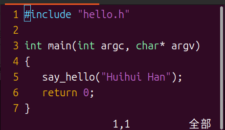
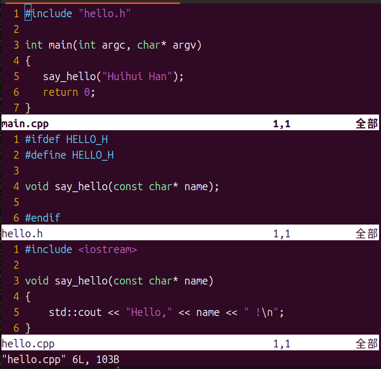
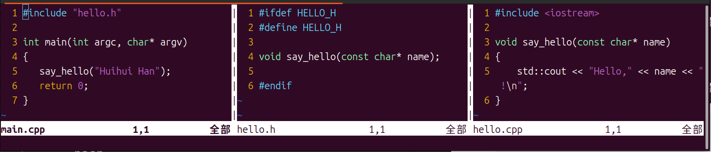

# {{ $frontmatter.title }}

## nano
`nano`的配置文件分为系统配置文件和用户配置文件。
```bash
binzz@C7VF:~$ whereis nanorc
nanorc: /etc/nanorc /usr/share/man/man5/nanorc.5.gz
binzz@C7VF:~$ 
```
说明系统配置文件为`/etc/nanorc`。不过为了保证安全性，我们还是使用用户配置文件`~/.nanorc`。默认是没有这个文件的，新建一个即可。
```bash
nano ~/.nanorc    # 有则打开，无则新建再打开，然后编辑
```
### 设置tab键空格数
尝试在配置文件中查找“tab”字眼。如果是用nano打开的配置文件，则按 `Ctrl + W` 键，输入“nano”并按回车即可找到如下内容：
```bash
## Use this tab size instead of the default; it must be greater than 0.
set tabsize 8
```
将8改为4，则设置tab键的长度为四个空格。
### 显示行号
- 临时显示
按`Alt + Shift + 3`即可显示或取消显示行号。另外，按`Ctrl + C`显示当前行的行号，还有文档百分比、光标位置、文档字数等信息。
- 永久显示
    在配置文件末尾加上如下语句即可：
    ```bash
    # Show linenumbers
    set linenumbers
    ```


## vim
`vim`的配置文件分为系统配置文件和用户配置文件。
```bash
binzz@C7VF:~$ vim --version
VIM - Vi IMproved 9.1 (2024 Jan 02, 编译于 Apr 01 2025 20:12:31)
包含补丁: 1-16, 647, 678, 697
修改者 team+vim@tracker.debian.org
编译者 team+vim@tracker.debian.org
巨型版本 无图形界面。  可使用(+)与不可使用(-)的功能:
# ...省略多行输出
-farsi             -mouse_sysmouse    -tag_old_static    
     系统 vimrc 文件: "/etc/vim/vimrc"
     用户 vimrc 文件: "$HOME/.vimrc"
 第二用户 vimrc 文件: "~/.vim/vimrc"
      用户 exrc 文件: "$HOME/.exrc"
       defaults 文件: "$VIMRUNTIME/defaults.vim"
         $VIM 预设值: "/usr/share/vim"
编译方式: # 一个很长的行，省略
链接方式: # # 一个很长的行，省略
binzz@C7VF:~$
```
为保证安全性，建议在用户配置文件`~/.vimrc`中进行配置。默认是没有这个文件的，新建一个即可。
```bash
vim ~/.vimrc    # 有则打开，无则新建再打开，然后编辑
```
### 显示行号
- 临时显示
在命令模式下输入`:set nu`并按回车即可。如果不想要行号了，则在命令模式下输入`:set nonu`，按回车即可。
- 永久显示
    在配置文件末尾加上如下语句：
    ```bash
    " Show linenumbers
    set nu
    ```
    则vim启动时，自动运行`:set nu`命令，于是显示了行号。“Show linenumbers”一行为注释。要养成添加注释的好习惯。

### 打开鼠标
在配置文件末尾加上`set mouse=a`即可。

### 实时报告
在配置文件末尾加上`set report=0`即可。


### 批量替换
#### Basic Global Replacement
- Replace in the entire file:
    ```bash
    :%s/oldtext/newtext/g
    ```
- With confirmation:
    ```bash
    :%s/oldtext/newtext/gc
    ```
#### Range-Specific Replacement
- Replace in specific lines in a range:
    ```bash
    :5,10s/foo/bar/g
    ```
- Current line only:
    ```bash
    :s/foo/bar/g
    ```
#### Regex-Based Replacement
- Match whole words only:
    ```bash
    :%s/\<word1\>/word2/g
    ```
- Replace using patterns (e.g., replace all digits with *):
    ```bash
    :%s/\d/*/g
    ```
#### Multi-File Batch Replacement
- Open multiple files in Vim:
    ```bash
    vim file1.txt file2.txt
    ```
- Run:
    ```bash
    :argdo %s/old/new/g | update
    ```
#### Tips for Safe Bulk Edits
- Always use gc for confirmation when unsure.
- Use regex boundaries (\< \>) to avoid partial matches.

- For large projects, combine Vim with shell tools like grep or find to target specific files before running replacements.


### vim常用命令
#### 打开多个文件
最普通的模式：
```bash
vim 文件名1 文件名2 ... 文件名N
```
但如下图，只会显示出第一个文件。

此时在命令模式下：
- **`:ls`** ：查看打开的所有文件。
- **`:b 编号`**：根据文件序号切换文件。
- **`:b 文件名`**：根据文件名切换文件。
- **`:n`**：切换到下一个文件。
- **`:N`**：切换到上一个文件。
```bash
vim -o 文件名1 文件名2 ... 文件名N
```
效果如下：

```bash
vim -O 文件名1 文件名2 ... 文件名N
```
效果如下：



#### 关闭
1. 关闭当前文件
    - **`:q`**：关闭当前文件。
    - **`:qa`**：关闭所有文件。
2. 关闭当前文件
    - **`:wq`**：保存并关闭当前文件。
    - **`:wqa`**：保存并关闭所有文件。
    - **`:q!`**：不保存并关闭当前文件。
    - **`:qa!`**：不保存并关闭所有文件。

#### 打开后在vim窗口中
以下命令均要在命令模式下，用英文输入法输入。
##### 执行后会跳转到插入模式的命令
| 效果 | 命令 |
| :--: | :--: |
| 在光标下方一行插入一空行 | o（小写字母） |
| 在光标上方一行插入一空行 | O （大写字母）|
| 在光标下一个字符处插入 | a |
| 在光标所在行的行尾插入 | A | 
| 替换光标后的一个字符 | r |
| 替换光标所在行中，光标后面的所有字符 | R |

##### 执行后依然在命令模式的命令
| 效果 | 命令 |
| :--: | :--: |
| 删除光标所在行。其实是剪切，会将被删除的行复制 | dd |
| 删除光标所在行，以及光标下方的行，共5行。其实也是剪切 | 5dd |
| 复制光标所在行 | yy |
| 复制光标所在行，以及光标下方的行，共5行 | 5yy |
| 在光标所在行下方粘贴最近复制的内容，这个内容只能来自vim | p | 
| 在光标所在行下方插入最近复制的内容5次，这个内容只能来自vim | 5p | 
| 撤销 | u |
| 恢复（反撤销）| Ctrl + R 键 |
| 光标跳转到行首 | 0（数字） |
| 光标跳转到行尾 | $ |
| 光标跳转到指定的第20行 | :20 |
| 重复前一个操作。准确来说，是本次命令模式下的上一个命令 | .（没错，就是一个点号） |
| 显示行号 | :set nu |
| 不显示行号 | :set nonu |
| 显示当前文件名 | :f |
| 显示用本vim窗口打开的所有文件名 | :files |
| 对所有标签页（整个窗口）执行同一个命令 | `
:windo \<command\> |
| 对当前标签页执行命令 | :tabdo \<command\> |


## Emacs

