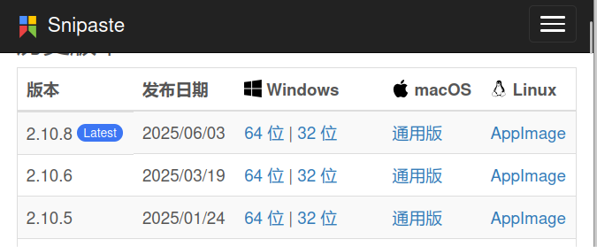

  
# {{ $frontmatter.title }}

总算解决了 Linux 在我们电脑磁盘上的存亡。现在进入我们可爱的 Linux，跟使用任何一台电脑一样，你一定非常关心：如何安装和卸载软件？如何查询它们的信息？这些都涉及软件包管理。

## 获取系统包管理器
```bash
binzz@C7VF:~$ cat /etc/os-release 
NAME="Linux Mint"
VERSION="22.3 (Zena)"
ID=linuxmint
ID_LIKE="ubuntu debian" # 很像 Ubuntu 和 Debian，推断这个系统的包管理器和 Ubuntu、Debian 一样，是 dpkg 和 apt
PRETTY_NAME="Linux Mint 22.3"
VERSION_ID="22.3"
HOME_URL="https://www.linuxmint.com/"
SUPPORT_URL="https://forums.linuxmint.com/"
BUG_REPORT_URL="http://linuxmint-troubleshooting-guide.readthedocs.io/en/latest/"
PRIVACY_POLICY_URL="https://www.linuxmint.com/"
VERSION_CODENAME=zena
UBUNTU_CODENAME=noble
```

## Snap 包管理器
Ubuntu 自带，应该避雷、卸载，不值得学习。
### 为什么是“雷”？
Snap是一个Ubnuntu自带的软件包管理工具，但是它也有一些问题，看看下面韩会会的踩雷记录就知道了。

1. [在 Visual Studio Code 报错的罪魁祸首](https://blog.csdn.net/2302_80010023/article/details/147580675?spm=1001.2014.3001.5501)
2. 经历了上面一点的教训，我安装软件包都用apt。有一天在Ubuntu安装0ad这个游戏，大约2GB。可是使用apt安装时报错，说是依赖项有问题，解决方法是使用`apititude`或者`snap`。我没有安装 aptitude，不想安装更多东西，所以选择了 snap 。不在snap安装开发类的软件，装个游戏总可以吧！安装前系统剩余71.1GB，安装后剩余69.3GB，又卸载该游戏（sudo snap remove 0ad），发现依然剩余69.3GB。还我空间！！！

针对第二点，查询了相关资料，了解到snap的缓存和版本保存机制——默认保留卸载应用的旧版本，目的是想有个备份，可以重新安装得更快，但也占用了不少空间。这就是一点都卸载不干净的原因，哪怕你用的是 `sudo snap remove \<packagename\> --purge`。更可恶的是，snap虽然可以设置为每个软件保留的版本数，但竟然至少是2！这坚定了我与snap分道扬镳的决心。

### 卸载Snap的步骤
1. 停止开机自启的Snap服务
    ```bash
    sudo systemctl disable snapd.service
    sudo systemctl disable snapd.socket
    sudo systemctl disable snapd.seeded.service
    ```
2. 卸载通过Snap安装的所有软件包
    ```bash
    snap list #查看所有已安装的软件包
    snap remove <packagename> --purge # 移除软件包。顺序：先删除应用软件，再删除非应用软件。可参照下面行的内容。

    #移除snap-store
    sudo snap remove snap-store
    #移除firefox
    sudo snap remove firefox
    #移除gnome-3-38-2004
    sudo snap remove gnome-3-38-2004
    #移除其它...
    
    #移除core20以及bare
    sudo snap remove core20
    sudo snap remove bare
    ```
3. 移除Snap
    ```bash
    # 使用apt移除snap
    sudo apt autoremove --purge snapd
    # 移除snap的残留目录
    sudo rm -rf /var/cache/snapd /var/lib/snapd ~/snap
    ```
4. 禁止重新安装Snap
    Snap已经被删除掉了，但还不够。比如你sudo apt install firefox时，会自动下载并重新安装snap服务。因为Ubuntu源中的一些软件已经是snap版本，而非deb版本，下载snap版本时，会自动检查并在必要时重新安装snap服务。sudo apt update时也会重新安装Snap。所以需要禁止重新安装Snap。
    ```
    sudo vim /etc/apt/preferences.d/nosnap.pref
    ```
    在文件中添加以下内容并保存：
    ```
    Package: snapd
    Pin: release a=*
    Pin-Priority: -10
    ```
    这样就可以了。但会带来一个问题，就是sudo apt install firefox会报错，因为它依赖snap，又不允许安装snap。
5. 重新安装firefox
    要安装 Firefox，通过以下命令使用官方 PPA 仓库。
    ```bash
    sudo add-apt-repository ppa:mozillateam/ppa
    sudo apt update
    sudo apt install -t 'o=LP-PPA-mozillateam' firefox
    ```
    很多教程的第三句直接是 sudo apt install firefox，是不对的，还是会因为尝试安装snap依赖而报错。

至此，彻底告别了Snap。参考网站：
- https://blog.csdn.net/qq_40229790/article/details/133653653
- https://zhuanlan.zhihu.com/p/511438456
- https://support.mozilla.org/zh-CN/kb/install-firefox-linux#w_shi-yong-ji-yu-debian-fa-xing-ban-de-deb-bao-an-zhuang-firefoxtui-jian


## .deb（Debian 系软件包）
软件源本质上就是一堆 HTTP 服务器，存放了安装包和包的索引列表，告诉软件包管理器“去哪里下载软件包”。

### dpkg 包管理器
```bash
sudo dpkg -i xx.deb     # 安装软件包
dpkg -I xx.deb         # 查看软件包的详细信息,其中Package字段是软件安装后的执行命令
dpkg -c xx.deb         # 列出.deb包内部的文件

sudo dpkg -P <软件名>   # 卸载单个软件包
sudo dpkg -r <软件名>   # 卸载软件包

dpkg -l                 # 查看所有已安装的软件包
dpkg -L <软件名>        # 查看软件相关的文件位置
```

### APT 包管理器
篇幅太长，见下一篇。

## .AppImage
`AppImage` 是一种把应用打包成单一文件的格式，通常是一个可执行文件，允许在各种不同的Linux发行版上运行，无需进一步修改。

如下图，部分软件的Linux的软件包中只有`AppImage`文件，所以有必要了解一下`AppImage`这种文件类型。


### 运行
1. 给`AppImage`文件添加可执行权限：
    ```bash
    chmod +x 软件名.AppImage
    ```
2. 直接运行`AppImage`文件：
    ```bash
    ./软件名.AppImage
    ```
可能遇到的问题：
```bash
binzz@C7VF:~$ ./Snipaste-2.10.8-x86_64.AppImage 
dlopen(): error loading libfuse.so.2

AppImages require FUSE to run. 
You might still be able to extract the contents of this AppImage 
if you run it with the --appimage-extract option. 
See https://github.com/AppImage/AppImageKit/wiki/FUSE 
for more information
binzz@C7VF:~$ 
```
提示需要安装`FUSE`后才能运行，安装方法如下：
```bash
sudo add-apt-repository universe
sudo apt install libfuse2t64
```
适用于 Ubuntu 24.04 及以上版本。详情参见[报错中提到的网站](https://github.com/AppImage/AppImageKit/wiki/FUSE)。
然后重新运行`AppImage`文件即可。

### 解包
1. 运行`AppImage`文件并添加`--appimage-extract`选项：
    ```bash
    ./软件名.AppImage --appimage-extract
    ```
2. 这将在当前目录下创建一个名为` squashfs-root`的目录，其中包含应用程序的所有文件。
3. 可以在` squashfs-root`目录中查看和修改应用程序的文件。
4. 如果想撤销解包操作，删除` squashfs-root`目录即可。

### 制作
1. 安装 `appimagetool`：
    ```bash
    sudo apt install appimagetool
    ```
2. 准备应用程序的所有文件，包括可执行文件和依赖的库。
3. 使用 `appimagetool` 打包应用程序：
    ```bash
    appimagetool 应用程序目录 应用程序名.AppImage
    ```
4. 生成的 `AppImage` 文件可以在任何支持 `FUSE` 的 Linux 发行版上运行。


## npm软件包管理
### 什么是 npm
NPM 总是与 [Node.js（Node）](https://nodejs.org/zh-cn/download)、[NVM](https://github.com/nvm-sh/nvm)、NPX 关联，以下是它们之间的关系，理清了这些，才知道它们的概念。

```text
  [ NVM (Node Version Manager) ]  <-- Manages multiple Node environments
               │
         ┌─────┴─────┐
      [Node v20]  [Node v22]      <-- The JavaScript runtime environments
         │
   ┌─────┴─────┐
[ NPM ]     [ NPX ]               <-- Tools that come bundled with Node
   │           │
Installs    Executes
Packages    Packages
```
这个体系是跨平台的，可以在 Windows、macOS 和各类 Linux/Unix 系统上运行。

### 环境搭建
以下步骤搭建了上面的体系。
```bash
# 下载并安装 nvm，如果想移除，参照 https://github.com/nvm-sh/nvm#manual-uninstall
curl -o- https://raw.githubusercontent.com/nvm-sh/nvm/v0.40.3/install.sh | bash

# 代替重启 shell，或执行 source ~/.bashrc
\. "$HOME/.nvm/nvm.sh"

# 下载并安装 Node.js：
nvm install 24

# 验证 Node.js 版本：
node -v # Should print "v24.18.0".

# 验证 npm 版本：
npm -v # Should print "11.16.0".
```

### 软件包管理：NPM
#### 安装
##### 本地安装
```bash
npm install <package_name>
```
这并不等于用户级安装，因为用户级安装指的是将可执行文件安装到`.local/bin`下，但 `npm install <package_name>` 的工作原理并非如此，而采取如下步骤：
1. 检查当前目录是否存在`package.json` 和 `package-lock.json` 文件、`node_modules` 目录，如果没有则新建。
2. 根据 `<package_name>` 在`package.json` 和 `package-lock.json` 文件中新增软件包名称和版本。两者的文件内容有区别，前者是**期望**（大概要什么）后者是**现实**（精准记录了最终装了什么）。
    > 比如你去餐厅，点了一碗牛肉面，服务员问你要不要辣，你说都可以，那么“牛肉面”就是期望；最终上了一份辣的牛肉面，那么“辣的牛肉面”就是现实。可以修改 `package.json` 但一定不要修改 `package-lock.json`。

3. 将 `package.json` 和 `package-lock.json` 提及的软件包安装在 `node_modules`目录下，相应的可执行文件在 `node_modules/.bin`目录下。判断逻辑为：
	```text
				运行 npm install
	                     │
	          ┌──────────┴──────────┐
	       有 lock       		没有 lock 
	          │                     │
	    ┌─────┴─────┐               │
	 有 json    没有 json         只根据 package.json 下载最新版本
	    │           │               │
	    │           ▼               ▼
	    │     严格按 lock 下载     自动生成新 lock 文件
	    │     并【逆向生成】json
	    ▼
	检查 json 和 lock 是否冲突？
	    │
	    ├─► 一致：严格按 lock 下载，100% 还原环境。
	    │
	    └─► 不一致（手动改了json）：以 json 为准下载，并【更新】lock 文件。

	（lock 指 package-lock.json，json 指 package.json）
	```
	上面的决策树回答了“听谁的”的问题。如果 `node_modules` 原本就存在，则会检查`node_modules`内的软件包是否符合要求，添加缺失的软件包、修改不对的版本、删除多余的软件包。

有点像 Python 虚拟环境，安装在哪里都行，起到隔离的作用，不会破坏用户和系统环境。Python 虚拟环境是为 Python 项目的开发服务的，而 NPM 呢？也是为 Node.js 项目的开发服务的！所以上述的“当前目录”是**一个 Node.js 项目的目录**。

如果 `<package_name>` 为空，即
```
npm install
```
则不会新增任何软件包，跳过第二步。

###### 生产依赖和开发依赖
上文提到，当前目录是一个 Node.js 项目目录，`package.json` 和 `package-lock.json` 记录的软件包其实就是这个项目的依赖包，有生产依赖和开发依赖之分：
* **dependencies（生产依赖）**： 项目在生产环境运行时必不可少的包（例如：Express 框架、Vue、React、Lodash 等）。
* **devDependencies（开发依赖）**： 仅在构建和开发阶段需要的工具（例如：代码检查工具 ESLint、打包工具 Webpack/Vite、测试框架 Jest、TypeScript 编译器等）。这些代码最终不会被打包发送给最终用户。

`npm install <package_name>` 默认将软件包添加到生产依赖中。加上 `--save-dev`（或 `-D`）选项，则添加到开发依赖。在 `package.json` 中体现为写入位置的不同：
```json
// package.json 内部对比示例
{
  "name": "my-project",
  "version": "1.0.0",
  
  // 1. 不加 -D：写入到 dependencies（生产依赖）
  "dependencies": {
    "express": "^4.18.2" 
  },

  // 2. 加上 -D：写入到 devDependencies（开发依赖）
  "devDependencies": {
    "eslint": "^8.56.0",
    "typescript": "^5.3.3"
  }
}
```

当项目部署到服务器时，如果运行 npm install --production，npm 将只会安装 dependencies 中的包，从而大幅缩短构建时间并节省服务器磁盘空间。


###### 作为开发者，如何对待`package.json` 和 `package-lock.json`？

为了避免“在我的电脑上明明是好的，换台电脑就报错”的尴尬情况，请遵循以下**最佳实践**：

**1. 📁 都要提交到 Git 仓库**
- `package.json` 和 `package-lock.json` **都必须**提交到你的 Git 代码仓库（比如 GitHub/Gitee）。
- 这样，当别人（或未来的你）在另一台电脑上拉取代码，运行 `npm install` 时，由于有 `package-lock.json` 的存在，NPM 就能瞬间完美复刻你今天安装的、一模一样的 `node_modules` 环境。

**2.  ⛔ 不要手动修改 package-lock.json**

永远不要用编辑器去手动改 `package-lock.json`。如果依赖冲突了或者想更新，使用 `npm install <packagename>@version` 或者 `npm update`，让 NPM 自己去更新它。

**3. 🚀 避坑指南：在服务器部署或团队拉取代码时**

当你在生产服务器上部署项目，或者团队成员刚从 Git 上拉取了最新的代码，最稳妥的安装命令不是 `npm install`，而是：

```bash
npm ci

```

* **`ci` 代表 Clean Install**。它是一个专门为自动化构建和部署设计的命令。
* 它会**严格只看** `package-lock.json`，如果发现它和 `package.json` 有不一致，会直接报错而不是去更新它。并且它在安装前会删掉旧的 `node_modules`，确保安装结果 100% 纯净和一致。


##### 全局安装
```bash
sudo npm install -g <package_name>
```
会将可执行文件连接到 `/usr/bin` 目录下，实现了全局安装。

#### 卸载
这还用说吗？`uninstall` 就完啦！
```bash
sudo npm uninstall <package_name>
```

### 执行软件：NPX
这里主要针对的是执行本地安装的软件包。要在项目根目录下执行：
```bash
npx <command> [...args]
```
等效于 `./node_modules/.bin/<command> [...args]`


## .rpm （RedHat系软件包）
`yum` 和 `dnf` 相当于 `apt`，前者是旧版，后者是新版。`rpm` 相当于 `dpkg`。

### dnf
```bash
sudo dnf check-update
sudo dnf update
sudo dnf install <package>
sudo dnf install <package.rpm>
sudo dnf remove <package>
```

### rpm
```bash
sudo rpm -ivh <package.rpm> # 不能自动解决依赖，建议用 dnf install <package.rpm>
```
