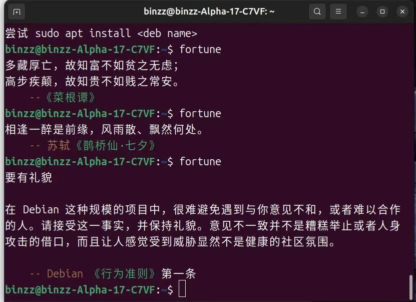
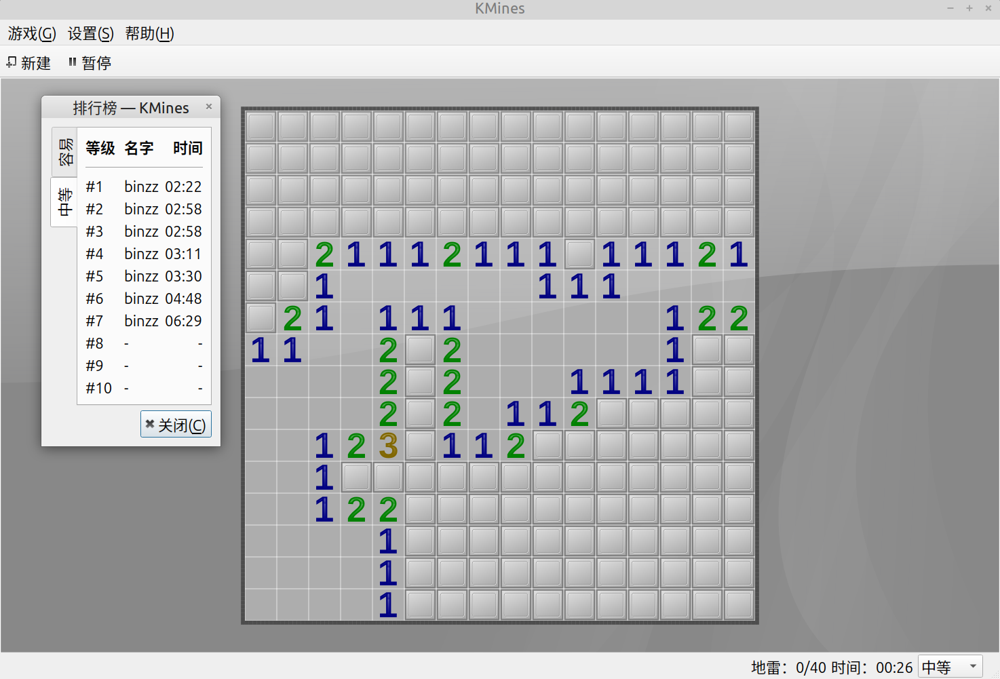

# {{ $frontmatter.title }}

## fortune名人名言 {#fortune}
安装方法:
```bash
sudo apt install fortunes-zh # 中文版名言
```
纪念一下，2025年5月5日14：00，韩会会没用几次就被提醒：《 要 有 礼 貌 》


## 本APT具有超级牛力
```bash
binzz@binzz-Alpha-17-C7VF:~$ apt | tail -n 2; apt moo; apt moo moo; apt moo moo moo
关于安全方面的细节可以参考 apt-secure(8).
                                         本 APT 具有超级牛力。
                 (__) 
                 (oo) 
           /------\/ 
          / |    ||   
         *  /\---/\ 
            ~~   ~~   
..."Have you mooed today?"...
                 (__)  
         _______~(..)~ 
           ,----\(oo) 
          /|____|,'    
         * /"\ /\   
           ~ ~ ~ ~     
..."Have you mooed today?"...
                     \_/ 
   m00h  (__)       -(_)- 
      \  ~Oo~___     / \
         (..)  |\        
___________|_|_|_____________
..."Have you mooed today?"...
binzz@binzz-Alpha-17-C7VF:~$ 
```
输入更多的`moo`，效果和输入三个`moo`相同。

话说APT的超级牛力除了上面打印出的牛，还有什么呢？`apt`是 Advanced Packaging Tools 的缩写，是`dpkg`的升级版，可以自动处理软件包的依赖关系，自动识别该执行`apt-get`还是`apt-cache`等命令。的确是“超级牛力”吧！😇

## KDE 还原 WinXP 时代经典游戏
https://kde.org/zh-cn/for/gamers/#%E5%9C%A8-kde-%E7%9A%84%E7%BB%8F%E5%85%B8%E6%B8%B8%E6%88%8F%E5%90%88%E9%9B%86%E4%B8%AD%E6%89%BE%E5%9B%9E%E7%86%9F%E6%82%89%E7%9A%84%E6%84%9F%E8%A7%89

比如下面的扫雷游戏 KMines。



