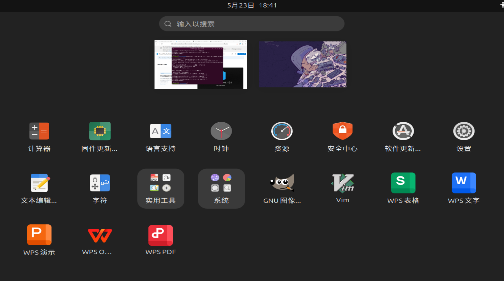
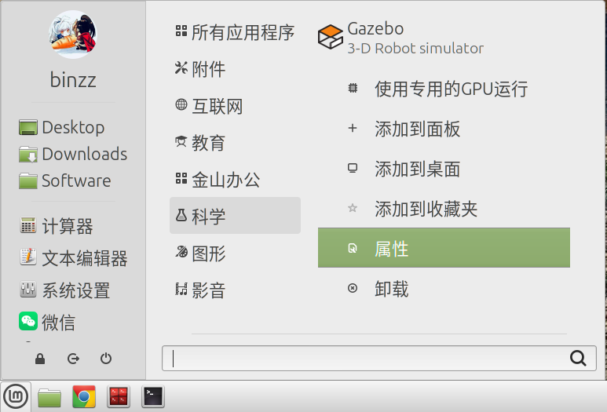
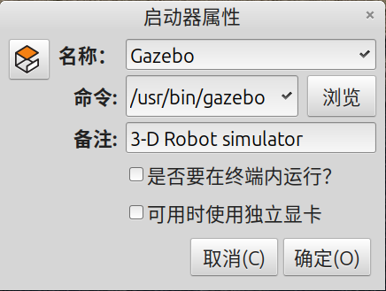

# {{ $frontmatter.title }}

Linux 的设计哲学是，一切皆文件。在菜单或任务栏、桌面上点开一个应用程序的图标，这个程序就运行了。你有没有想过这个图标实际上是什么呢？没错，就是一个 .desktop 文件，也称**启动器（Launcher）**。

部分桌面环境的菜单还对应用程序分了类，如下图所示，真的是非常体贴！WPS 还比较“霸道”地设置了自己的专属分类。可是有的分类我并不认同，可以修改吗？这就涉及 .desktop，.directory 和 .menu 文件之间的互动了。




这一切都遵循 [FreeDesktop 标准](https://www.freedesktop.org/wiki/)。


## 为什么要了解启动器
了解这些有什么用呢？原因太多了，除了上面的案例，我还可以举两个例子。

第一个例子是，你可以点开某个应用程序，但不知道运行这个应用程序的命令。有的桌面环境提供了如下图所示的便捷方法。





但另一些桌面环境，比如 GNOME，没有提供这一途径，不了解启动器的话，恐怕只能靠英语水平猜测、查找文件来验证了吧！

第二个例子，[Geogebra](https://download.geogebra.org/package/linux-port)，是一个免安装软件，针对 Linux 平台只提供了 .tar.gz 这样的压缩包，如何不需要进入压缩包目录就能运行 Geogebra，并且点开一个图标也能运行呢？就像是“安装”了一样。本页面将针对这个场景进行探讨。

假设这个压缩包被解压成了 `Geogebra` 目录，第一个问题不需要启动器就能解决，有如下两种方式：
1. 系统级安装
    ```bash
    sudo mv Geogebra /opt/
    sudo ln -s /opt/Geogebra/geogebra /usr/bin/geogebra
    ```
2. 用户级安装
    ```bash
    sudo mv Geogebra ~/.local/share/
    sudo ln -s ~/.local/share/Geogebra/geogebra ~.local/bin/geogebra
    ```

第二个问题呢？那就要使用启动器了。

用户级设置会覆盖系统级设置，相当于一个符合用户特定需求的补丁。这一点不仅仅是在启动器的设置，在任何方面的设置都适用。


## .desktop
| 系统级路径 | 用户级路径 |
| --- | --- |
| `/usr/share/applications/xx.desktop` | `~/.local/share/applications/xx.desktop` |

```bash
[Desktop Entry]
Name=Geogebra Classic 5
Comment=Dynamic Math Software
Comment[zh_CN]=动态数学软件
Exec=geogebra
Icon=geogebra
Type=Application
Categories=Education;
StartupNotify=true
Keywords=Run;
```
必选字段：
<table><thead><tr><th>字段名</th><th>说明</th><th>示例值</th></tr></thead><tbody><tr data-eusoft-scrollable-element="1"><td><code>Type</code></td><td>文件类型，常用值：<br>- <code>Application</code>：应用程序<br>- <code>Link</code>：URL 链接<br>- <code>Directory</code>：文件夹</td><td><code>Type=Application</code></td></tr><tr data-eusoft-scrollable-element="1"><td><code>Name</code></td><td>应用程序名称</td><td><code>Name=文本编辑器</code></td></tr><tr data-eusoft-scrollable-element="1"><td><code>Exec</code></td><td>启动命令，支持参数占位符。可识别<code>PATH</code>环境变量</td><td><code>Exec=gedit %F</code></td></tr><tr><td><code>Icon</code></td><td>图标名称或路径。若图标在系统图标主题中，直接填名称（无需扩展名）；路径填绝对路径或相对于<code>/usr/share/icons/</code>的路径。</td><td><code>Icon=gedit</code> 或 <code>Icon=/path/icon.png</code></td></tr></tbody></table>

可选字段：
<table><thead><tr><th>字段名</th><th>说明</th><th>示例值</th></tr></thead><tbody><tr data-eusoft-scrollable-element="1"><td><code>Comment</code></td><td>简短描述</td><td><code>Comment=GNOME 文本编辑器</code></td></tr><tr><td><code>Terminal</code></td><td>是否在终端中运行，<code>true</code>/<code>false</code>（默认 <code>false</code>）</td><td><code>Terminal=false</code></td></tr><tr data-eusoft-scrollable-element="1"><td><code>Categories</code></td><td>应用程序分类，决定启动器在哪个菜单，需符合 Freedesktop 规范</td><td><code>Categories=Utility;TextEditor;Development;</code></td></tr><tr data-eusoft-scrollable-element="1"><td><code>Keywords</code></td><td>搜索关键词（空格分隔），提升桌面环境搜索可发现性</td><td><code>Keywords=text;edit;note;</code></td></tr><tr data-eusoft-scrollable-element="1"></tr><tr><td><code>NoDisplay</code></td><td>是否在菜单中隐藏（<code>true</code> 表示仅后台使用，不显示）</td><td><code>NoDisplay=false</code></td></tr></tbody></table>


## .directory
| 系统级路径 | 用户级路径 |
| --- | --- |
| `/usr/share/desktop-directories/xx.directory` | `~/.local/share/desktop-directories/xx.directory` |

```ini
[Desktop Entry]
Name=Education
Name[zh_CN]=教育
Icon=applications-education
Type=Directory
```
到这里你会觉得奇怪， .desktop 和 .directory 还没有任何关联，我怎么把 Geogebra 放在“教育”下面呢？这就需要 .menu 文件了。

## .menu
不仅是 .desktop 和 .directory 之间的桥梁，还可以设置每个 .desktop 和 .directory 的显示与否，是靠匹配模式实现的。

| 系统级路径 | 用户级路径 |
| --- | --- |
| `/etc/xdg/menus/xx.menu` | `~/.config/menus/xx.menu` |

```xml
<Menu>
  <Name>Education</Name>
  <Directory>cinnamon-education.directory</Directory>
  <Include>
    <Category>Education</Category>
  </Include>
</Menu>
```

- `<Directory>` 指定用哪个 `.directory` 文件来显示这个菜单项（提供名称、图标等展示信息）
- `<Include>` 指定哪些 `.desktop` 会被归入这个`.menu`。`<Category>Education</Category>`匹配 `Categories`为`Education` 的启动器。还可以通过 `<FileName>` 指定特定的启动器，用`<And>`、`<Not>` 等逻辑运算。与 `<Include>` 同级、作用相反的键是 `<Exclude>`。
