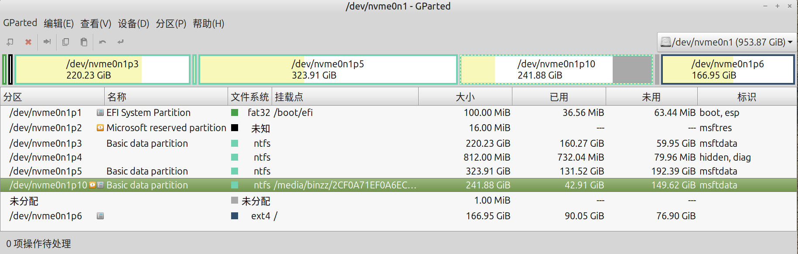

# {{ $frontmatter.title }}

## 过时的密钥环
```bash
W: http://packages.ros.org/ros/ubuntu/dists/focal/InRelease: 密钥存储在过时的 trusted.gpg 密钥环中（/etc/apt/trusted.gpg），请参见 apt-key(8) 的 DEPRECATION 一节以了解详情。
```
**解决方案：**
$\qquad$这是 Ubuntu 新版本（Ubuntu 20.04及以后）对密钥管理方式的改变。 Ubuntu 24.04 不再推荐使用`/etc/apt/trusted.gpg`，而是推荐`/usr/share/keyrings/`。建议按以下步骤迁移 ROS 密钥：
1.  导出原有密钥
```bash
sudo apt-key export 421C365BD9FF1F717815A3895523BAEEB01FA116 | sudo gpg --dearmour -o /usr/share/keyrings/ros-archive-keyring.gpg
```
如果出现以下情况：
```bash
binzz@C7VF:~$ sudo apt-key export 421C365BD9FF1F717815A3895523BAEEB01FA116 | sudo gpg --dearmour -o /usr/share/keyrings/ros-archive-keyring.gpg
Warning: apt-key is deprecated. Manage keyring files in trusted.gpg.d instead (see apt-key(8)).
gpg: 警告：没有导出任何东西
gpg: 找不到有效的 OpenPGP 数据。
```
这个错误表明 `apt-key export` 无法正确导出密钥，可能是因为密钥已经被删除或损坏。我们可以通过以下步骤重新添加 ROS Noetic 的 GPG 密钥并修复 APT 配置：
(1) 重新下载并安装 ROS Noetic 的 GPG 密钥到 `/usr/share/keyrings/`
```bash
curl -s https://raw.githubusercontent.com/ros/rosdistro/master/ros.asc | sudo gpg --dearmor -o /usr/share/keyrings/ros-noetic-keyring.gpg
```
(2) 确保你的 `ros-latest.list` 文件正确指向这个密钥
```bash
echo "deb [signed-by=/usr/share/keyrings/ros-noetic-keyring.gpg] http://packages.ros.org/ros/ubuntu focal main" | sudo tee /etc/apt/sources.list.d/ros-latest.list
```
(3) 检查密钥是否正确安装
```bash
ls /usr/share/keyrings/ | grep ros    # 检查 `/usr/share/keyrings/` 是否有密钥文件
```
应该在输出中能看到 `ros-noetic-keyring.gpg`。
(4) 更新 APT：
```bash
sudo apt update
```
2. 删除旧密钥，不过不建议执行这一步
```bash
sudo apt-key del 421C365BD9FF1F717815A3895523BAEEB01FA116
```
3.  修改 sources.list 中的 ROS 源（nano是一种文本编辑器，可以换成你喜欢的编辑器）
```bash
sudo nano /etc/apt/sources.list.d/ros-latest.list
```
将行改为：
```shell
deb [signed-by=/usr/share/keyrings/ros-archive-keyring.gpg] http://packages.ros.org/ros/ubuntu focal main
```
4. 更新软件库：
```shell
sudo apt update
```
没有警告和报错即可。


## 不能执行存在且有执行权限的shell脚本
```bash
binzz@C7VF:~$ ll pack.sh
-rwxr-xr-x 1 binzz binzz 920  6月  3 12:49 pack.sh* # 有输出，说明文件存在；x说明有执行权限
binzz@C7VF:~$ ./pack.sh
bash: ./pack.sh: 无法执行：找不到需要的文件 # 却报这个错误
binzz@C7VF:~$
```
原因：
1. sh文件不以`#!/bin/bash`开头。此时只需加上这个开头即可。
2. sh文件是在Windows下编写的。Windows的换行符是`\r\n`，而Linux下的换行符是`\n`，两者不兼容，可用`dos2unix`工具进行转换。
	```bash
	dos2unix pack.sh
	```

## 磁盘挂载类错误
### Windows盘挂载错误 {#Windows盘挂载错误}
完成卸载，且可以正常登录其他系统。但是在 Ubuntu 24.04.2 LTS 中，发现我的E盘（`/dev/nvme0n1p10`）无法挂载，这是因为我的E盘在我卸载 Ubuntu 20.04.6 LTS 时，发生过移动，导致E盘的UUID（表示分区首地址）和分区末地址发生了变化。报错信息为：
```bash
Error mounting /dev/nvme0n1p10 at/media/username/2CF0A71EF0A6ECF0:	wrong fs type, bad option, bad superblock on/dev/nvme0n1p10, missing codepage or helper program, or other error (udisks-error-quark, 0)
```
**解决方案：**
首先尝试挂载E盘，比如双击任务栏上E盘对应的图标。然后运行如下命令：
```bash
username@DeviceName:~$ sudo dmesg | tail
[sudo] username 的密码： 
# 省略多条信息，只保留以下有用部分。E盘的文件系统是NTFS .
[  202.787359] ntfs3: Enabled Linux POSIX ACLs support
[  202.787363] ntfs3: Read-only LZX/Xpress compression included
[  202.787923] ntfs3: nvme0n1p10: It is recommened to use chkdsk.
[  202.806195] ntfs3: nvme0n1p10: volume is dirty and "force" flag is not set!  # 关键信息
username@DeviceName:~$ sudo ntfsfix -d /dev/nvme0n1p10
Mounting volume... OK
Processing of $MFT and $MFTMirr completed successfully.
Checking the alternate boot sector... OK
NTFS volume version is 3.1.
NTFS partition /dev/nvme0n1p10 was processed successfully.
username@DeviceName:~$
```
然后就可以正常挂载E盘了！

### 已用 + 未用 < 总量

注意到 `nvme0n1p10` 的灰色部分，虽然在 `nvme0n1p10` 内，但处于未利用的状态，在 Gparted 能识别出，但在 Windows 中不能。这是 `nvme0n1p10` 扩容异常的缘故。

✅ **解决方案**
1.  重启进入 Windows，找到该分区。
2.  右键 → 属性 → 工具 → 查错 → 检查 → 扫描驱动器 → 修复驱动器。
3.  回到 Linux Mint，先卸载该分区：
    ```bash
    sudo umount /dev/nvme0n1p10
    ```
4.  检查并修复 NTFS：
    ```bash
    sudo ntfsresize --info /dev/nvme0n1p10  # 查看当前文件系统大小
    sudo ntfsresize /dev/nvme0n1p10        # 让文件系统扩容到分区表大小
    ```
    `ntfsresize` 会安全地将 NTFS 扩展到整个分区，不会丢失数据。

5.  修复后重新挂载，GParted 里的“已用+未用”就会和“大小”一致。


### 挂载LVM2分区错误 {#挂载LVM2分区错误}
```bash
binzz@C7VF:~$ lsblk /dev/nvme0n1p8 -f
NAME      FSTYPE      FSVER    LABEL UUID                                   FSAVAIL FSUSE% MOUNTPOINTS
nvme0n1p8 LVM2_member LVM2 001       G80P3l-sVD1-0sT9-0xm7-23OY-C1HN-cwyEuI                
└─rl-root xfs                        d9a6d2b0-da1f-478e-858d-31fbe7917ded                  
binzz@C7VF:~$ sudo mount /dev/nvme0n1p8 /mnt/rocky/
mount: /mnt/rocky: 未知的文件系统类型“LVM2_member”.
       dmesg(1) may have more information after failed mount system call.
binzz@C7VF:~$ sudo lvscan
  ACTIVE            '/dev/rl/root' [77.29 GiB] inherit
binzz@C7VF:~$ sudo mount /dev/rl/root /mnt/rocky/
binzz@C7VF:~$ ls /mnt/rocky/
afs  bin  boot  dev  etc  home  lib  lib64  media  mnt  opt  proc  root  run  sbin  srv  sys  tmp  usr  var
binzz@C7VF:~$
```
