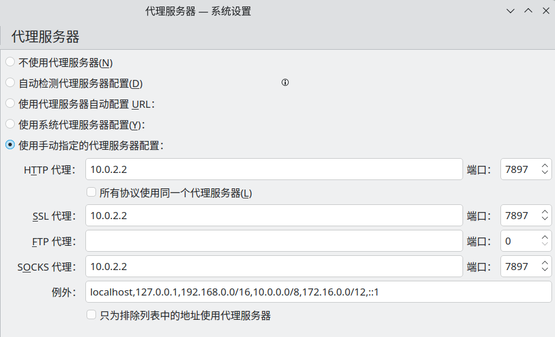
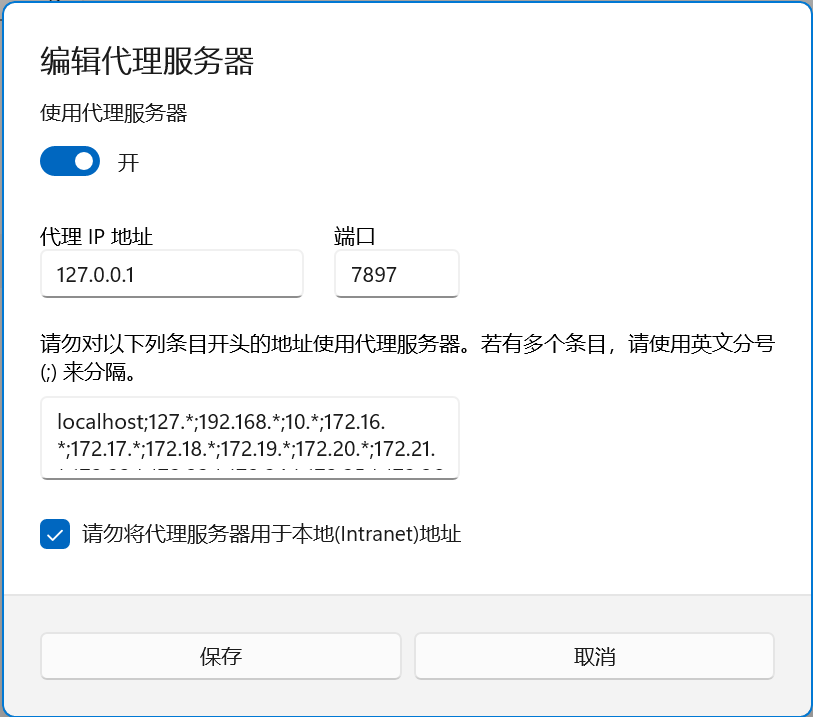
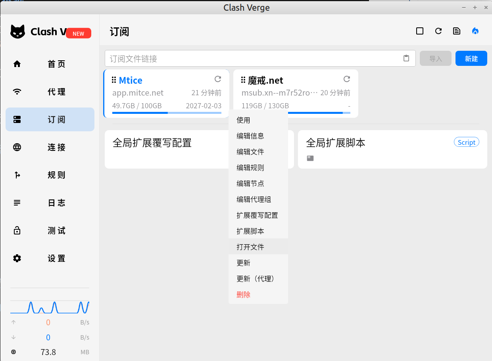
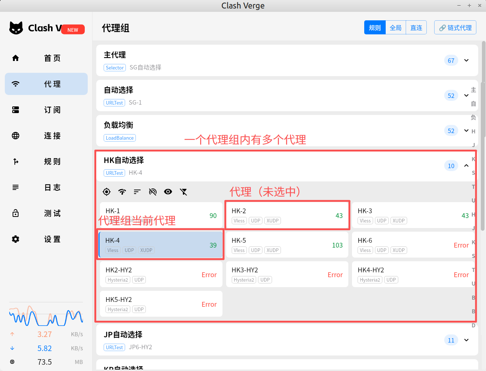

# {{ $frontmatter.title }}

[下载页](https://github.com/clash-verge-rev/clash-verge-rev/releases/)

[官方文档](https://www.clashverge.dev/index.html)

**Description：** {{ $frontmatter.description }}。

| 适用系统 | 类型 | 标签 |
| --- | --- | --- |
| {{ $frontmatter.os.join(', ') }} | {{ $frontmatter.category.join(', ') }} | {{ $frontmatter.tags.join(', ') }}

::: danger 免责声明
代理工具只是为了访问网站的方便，若因查看本文档而利用这一点从事任何违法活动，笔者不承担任何责任！！！
:::

## 基本使用

安装后，导入订阅，开启系统代理即可。

### 系统代理的开关对系统网络设置的影响
开启或关闭系统代理后，Clash Verge 会修改系统相应的环境变量，这些变量的值，一是可以在系统终端查看，二是在软件设置中，使用复制环境变量的功能，以前者为例：
```bash
binzz@C7VF:~$ echo -e "HTTP_PROXY=${HTTP_PROXY}\nHTTPS_PROXY=${HTTPS_PROXY}\nALL_PROXY=${ALL_PROXY}"
HTTP_PROXY=http://127.0.0.0:7897/
HTTPS_PROXY=http://127.0.0.0:7897/
ALL_PROXY=socks://127.0.0.0:7897/
binzz@C7VF:~$
```

其中，`127.0.0.0` 表示本地IP地址，`7897` 表示代理端口。

如果打开系统的网络代理设置界面，也可以看到发生了相应变化。
1. **Linux 发行版**
	不同桌面环境的设置入口不同，但提供的选项基本是一样的，下图以 KDE 桌面环境为例。
	
2. **Windows 系统**
	Windows 11 的网络代理设置入口为，设置 -> 网络和Internet -> 代理 -> 手动设置代理 -> “使用代理服务器”右边的编辑按钮。
	

本质上，以上IP和端口都对应了上文所述的环境变量。

## 订阅、代理、代理组、代理规则
一个服务商表示为一个**订阅**。每个订阅都有各自相应的 .yaml 配置文件，定义了该订阅的代理（`proxies`）、代理组（`proxy-groups`），规定了代理规则（`rules`）。


一个服务商有许多服务器，每个服务器都有自己的端口、密码、协议等，在订阅的配置文件内定义为一个**代理**，在下图中名称为 HK-1、HK-2 等。**代理组**是若干代理的集合。每个代理组都有当前代理，选择的方式 （`type`）可以是人为选择的（`select`），也可以是根据连通性测试结果自动分配的（`url-test`）等，在代理组的定义中规定了当前代理的选择方式。


```yaml
proxy-groups:
  -
    name: 主代理
    type: select
    proxies:
      - 自动选择
      - 负载均衡
      - HK自动选择
```

当访问的网站符合某条代理规则时，为用户访问该网站提供代理服务的代理就是相应代理组的当前代理。例如访问 https://www.google.com/ ，域名含有 google 字样，而规则规定域名含 goole 字样的网站使用一个名为 Google 的代理组，则本次代理服务将由 Google 代理组的当前代理提供，帮助国内用户顺利访问谷歌。

订阅会提供默认的代理规则，用户可以通过 Clash Verge 进行自定义，详情参考[官方文档](https://www.clashverge.dev/guide/rules.html)。但自定义的规则只在一个订阅中生效。
