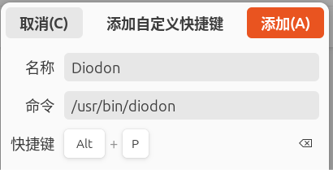
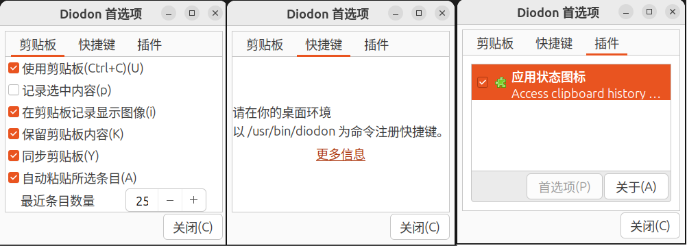
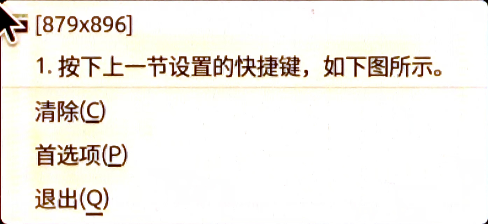

# {{ $frontmatter.title }}

[官网](https://launchpad.net/diodon)

**Description：** {{ $frontmatter.description }}。

| 适用系统 | 类型 | 标签 |
| --- | --- | --- |
| {{ $frontmatter.os.join(', ') }} | {{ $frontmatter.category.join(', ') }} | {{ $frontmatter.tags.join(', ') }}


## 安装与设置
```bash
sudo apt install diodon
```
Diodon不支持在Diodon内部设置启动快捷键，请在系统设置中设置，如下图所示。

现在按下你设置的快捷键，进入首选项逛一逛，如下图所示。

唯一可以设置的就是剪贴板一栏。
## 使用
如果按上一张图设置，那么每复制一次，就会自动保存到Diodon中。现在的问题是，如何调用Diodon中的内容呢？
1. 按下上一节设置的快捷键，如下图所示。屏幕空间充足时，这个小窗口的左上角总是在光标处。小窗口分为剪贴板内容和指令区两部分。

2. 按上下键选择，再按Enter键，或者直接用鼠标点击，即可调用选择的内容，或者清除（删除剪贴板的所有内容）、进入首选项、退出。
3. 注意到上图中，第一个内容是一张图片，说明Diodon支持图片。不过在微信聊天记录复制的图片不能加载到Diodon中，微信截图的图却可以。

怎么样，非常easy吧？可以满足绝大多数需求。更高级的，比如CopyQ，可以设置常驻剪贴板、编辑剪贴板、各种自定义。不过我试过，比较复杂，且对于我来说，似乎不太必要，复制图片的效果也并不理想，所以才选择了Diodon。
