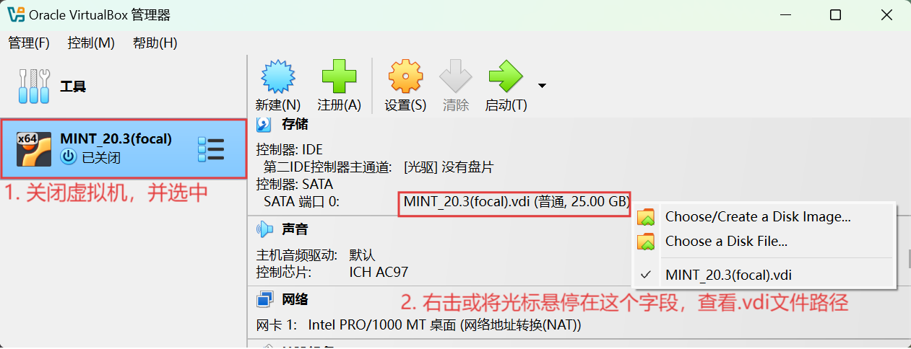
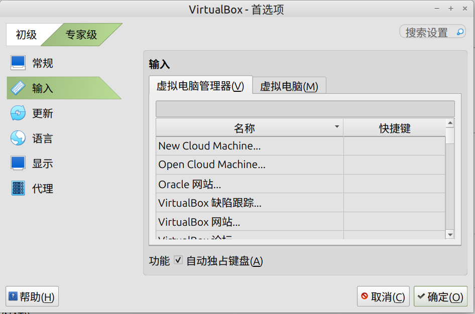
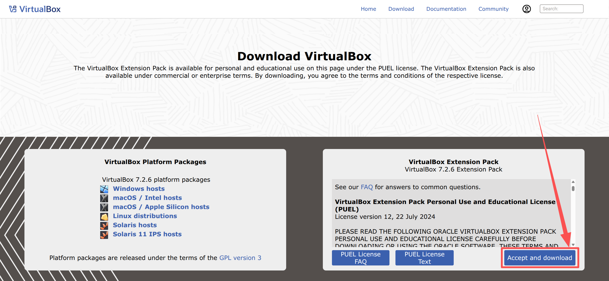
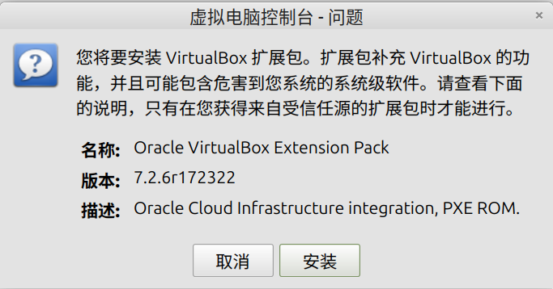
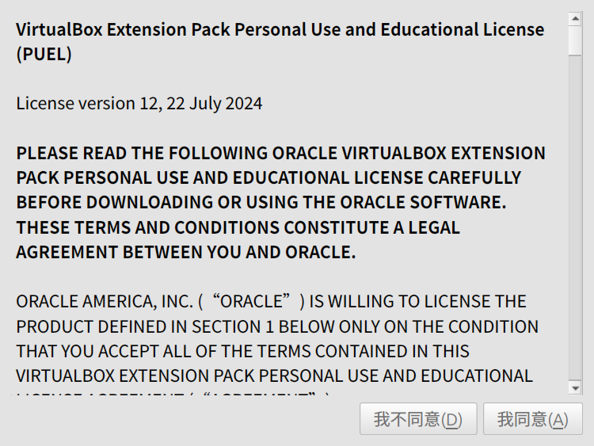
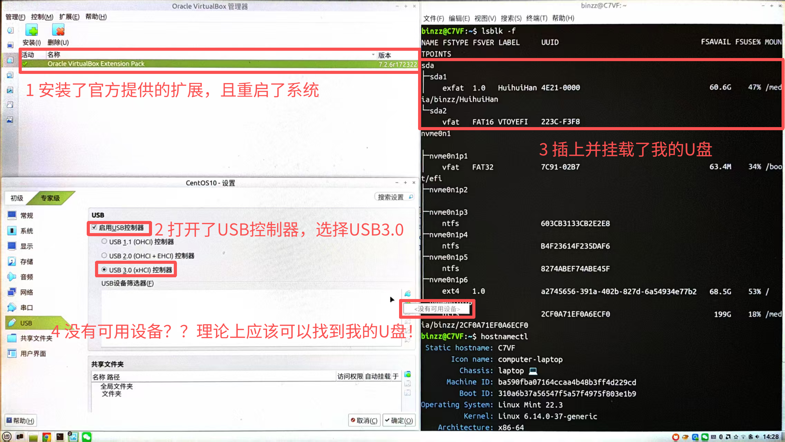
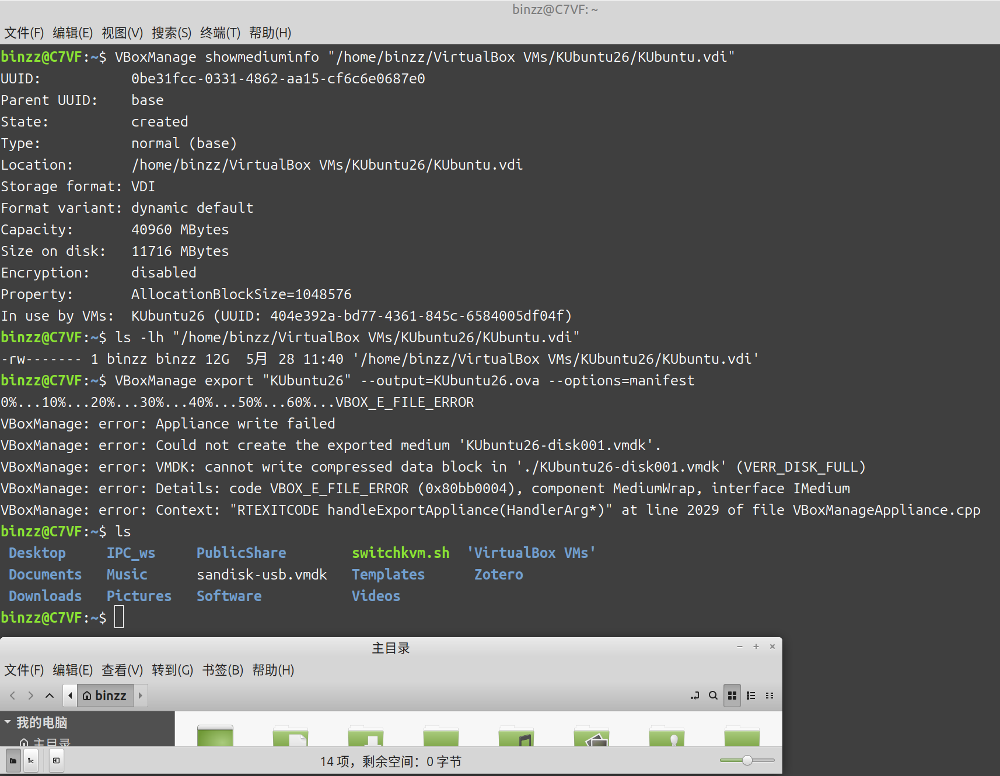

# {{ $frontmatter.title }}

[下载页](https://www.virtualbox.org/wiki/Downloads)

**Description：** {{ $frontmatter.description }}。

| 适用系统 | 类型 | 标签 |
| --- | --- | --- |
| {{ $frontmatter.os.join(', ') }} | {{ $frontmatter.category.join(', ') }} | {{ $frontmatter.tags.join(', ') }}


## .vdi 文件
.vdi 文件是 VirtualBox 最早的虚拟磁盘文件格式，也最常用。打开虚拟机设置的“存储”一项，可以发现虚拟机的系统储存在 .vdi 文件中，相当于实体机的系统安装在硬盘。

.vdi 文件需要使用 VirtualBox 提供的工具进行管理，后文会解释原因，以及如何管理。这个工具在 `bash` 中没有自动补全的功能，不一定是自己把命令输入错了。

### 寻找 .vdi 文件路径 {#寻找.vdi文件路径}


### 查看虚拟磁盘信息 {#查看虚拟磁盘信息}
```bash
VBoxManage showmediuminfo to_check.vdi
```
输出示例：
```bash
UUID:           64c7bb70-db83-4df1-bea9-97fdab0aeedb
Parent UUID:    base
State:          created
Type:           normal (base)
Location:       /home/username/VirtualBox VMs/to_check/to_check.vdi
Storage format: VDI
Format variant: dynamic default
Capacity:       40960 MBytes
Size on disk:   16044 MBytes
Encryption:     disabled
Property:       AllocationBlockSize=1048576
In use by VMs:  to_check (UUID: 1db9fd5b-13f4-4ce3-b77a-95be1b3fa7e5)
```


### 复制 {#复制.vdi文件}
不能直接用 `cp` 命令，因为 UUID 会重复，产生冲突，正确做法是：
```bash
VBoxManage clonehd source.vdi destination.vdi
```
会给 `destination.vdi` 生成一个新的 UUID。

案例：解决[导出虚拟电脑导致磁盘爆满](#导出虚拟电脑导致磁盘爆满)的问题

### 删除
不能直接用 `rm` 命令，这样的话注册信息还是残留的，下次创建同名 .vdi 文件时会报错。正确做法是：
```bash
VBoxManage closemedium disk to_remove.vdi --delete
```


### 扩容
一台虚拟机只有 25GB，需要进行扩容。

网络上很多方法是选择“工具->介质”，但我这边没有“介质”的选项，所以只能靠命令行帮忙了。

若使用 PowerShell，请以管理员身份执行。

1. 按照[查看虚拟磁盘信息](#查看虚拟磁盘信息)的方法，查看虚拟磁盘的 `Format variant`一项，静态(fixed)或动态(dynamic)。如果是静态的，则需要转换为动态：
    ```bash
    VBoxManage clonemedium to_expand.vdi to_expand_dynamic.vdi --variant Standard
    ```
    这个步骤会创建一个新的.vdi文件 `to_expand_dynamic.vdi`，原.vdi文件 `to_expand.vdi` 不变。

    如果在转换为动态时报错，可能是因为`to_expand_dynamic.vdi`存在，或者不存在，但有它的注册信息的残留。不论哪种情况，都需要先用 `VBoxManage closemedium disk to_expand_dynamic.vdi --delete` 删除，再重新转换。
    
3. 扩容动态的.vdi文件。
    ```bash
    VBoxManage modifymedium to_expand_dynamic.vdi --resize 50000
    ```
    最后一个参数表示扩容后的虚拟磁盘大小，单位是 MB，所以 50000 代表 50000MB $\approx$ 48.83GB。

4. 更改虚拟机的.vdi文件为扩容后的.vdi文件`to_expand_dynamic.vdi`，可参照[找vdi方法](#寻找.vdi文件路径)的图。
5. 现在给虚拟磁盘扩容了，但扩容多出来的空间还处于未分配的状态，故打开虚拟机，使用GParted工具，调整分区大小，将多出来的空间真正分配给 Linuxmint 20.3。至此，扩容完成。

### 缩容 {#缩容}
首先在相应虚拟机上用零填满 `.vdi` 的剩余空间。
```bash
dd if=/dev/zero of=~/wipefile bs=1M
rm ~/wipefile
```
然后关闭虚拟机，在宿主机操作（同样需要 .vdi 文件是动态的）：
```bash
VBoxManage modifymedium disk to_shrink_dynamic.vdi --compact
```

## 键盘独占模式
使按下的快捷键被虚拟机而非宿主机捕获，例如按下 Super 键，打开的是虚拟机而非宿主机的菜单。要实现这样的功能，请打开 VirtualBox 菜单栏的 “管理 -> 全局设定”，弹出如下窗口，勾选“自动独占键盘”。



### 💡 补充：其他常见的“冲突”按键
即使启用了独占，有些按键组合因为被操作系统底层占用，也可能无法直接发送给虚拟机。针对这些情况，VirtualBox 也提供了解决方案：

| 按键组合 | 默认行为 | 发送给虚拟机的方法 |
| :--- | :--- | :--- |
| **`Ctrl + Alt + Delete`** | 锁定宿主机或打开安全选项。 | 在虚拟机窗口菜单栏点击 **Input (输入)** > **Keyboard (键盘)** > **Insert Ctrl+Alt+Del** |
| **`Alt + Tab`** | 在宿主机程序中切换。 | 修改全局偏好设置：**File > Preferences > Input**，勾选 **"Auto-capture keyboard"** |
| **`Ctrl + Alt + F1`~`F12`** | 切换宿主机的虚拟控制台（Linux）。 | 使用快捷键 **Host 键 + F1**~**F12** |

如果尝试了以上方法仍无效，可以检查一下虚拟机是否安装了 **VirtualBox Guest Additions（增强功能）**。安装它不仅能提升鼠标切换的流畅度（实现鼠标无缝移出），也是键盘正常工作的基础保障。


## 虚拟机网络设置
如果宿主机可以科学上网，想让虚拟机也能科学上网的话，除了在虚拟机上像宿主机那样使用 VPN 外，还有一种方法是，在虚拟机上配置网络代理。

首先，你需要阅读 [Clash_Verge 一节](Clash_Verge.md)，了解 Clash_Verge 这类代理工具实现 VPN 的工作原理。根据 [Clash_Verge 一节](Clash_Verge.md)，我们需要获取宿主机的 IP 地址和端口号，然后填入虚拟机的网络代理设置中。端口号容易解决，在宿主机上的代理工具或网络代理设置中找。下面介绍获取IP地址的方法。

::: danger 免责声明
科学上网、VPN等技术只是为了访问网站的方便，若因查看本文档而利用这一点从事任何违法活动，笔者不承担任何责任！！！
:::

### 情况一：虚拟机的网卡为 NAT模式
NAT 即 Network Address Translation，网络地址转换，流程 如下：
1. 虚拟机软件内置一块**虚拟路由**，把宿主机和虚拟机隔成两层网络，虚拟机在内层，宿主机在外层。
2. 虚拟机发外网请求 → 发给虚拟网关（虚拟路由）；
3. 虚拟路由把虚拟机内网IP**替换成宿主机物理IP**，再向外网发送；
4. 外网回复数据 → 虚拟路由根据记录转回对应虚拟机。

关键点：
- 虚拟机和宿主机属于**两个不同网段**；
	- 例如，宿主机 Ubuntu IP：`192.168.137.128`，虚拟机网关：`192.168.137.2`（虚拟路由）。
- 虚拟机无法被局域网其他设备主动发现；
- 所有虚拟机上网流量**必须经过宿主机**。

在虚拟机上：
```bash
binzz@Virtualbox:~$ ip route
default via 10.0.2.2 dev enp0s3 proto dhcp metric 100 
10.0.2.0/24 dev enp0s3 proto kernel scope link src 10.0.2.15 metric 100 
169.254.0.0/16 dev enp0s3 scope link metric 1000 
binzz@Virtualbox:~$ 
```
其中 `default via` 后面的IP地址`10.0.2.2`，就是虚拟机眼中宿主机的IP地址。

### 情况二：虚拟机的网卡为桥接模式
虚拟机网卡和宿主机物理网卡并联在同一个局域网交换机上，虚拟机相当于一台和宿主机**平级、独立**的真实物理电脑。
- 路由器 DHCP 会给虚拟机分配一个**局域网独立IP**，和宿主机同网段；
- 局域网内所有设备（手机、其他电脑、宿主机）都能直接 ping 通虚拟机；
- 虚拟机对外网请求，直接走路由器，不经过宿主机做地址转换。

举个例子，路由器网段 `192.168.1.0/24`
- 宿主机：`192.168.1.100`
- 桥接虚拟机：`192.168.1.103`
两者都是路由器分配的IP，地位完全平等。

在宿主机上，若宿主机为 Linux：
```bash
ip addr show
```
若宿主机为 Windows，则执行 `ipconfig`，输出中 “IPv4 地址” 一项就是宿主机的IP地址。

需要注意的是，如果宿主机切换了网络，需要重新执行 `ipconfig` 以获取新的IP，更新虚拟机的网络设置。而虚拟机的网卡为 NAT 模式时则不存在这个问题。


## USB 功能
#### 普通USB
需要去[官网的下载页](https://www.virtualbox.org/wiki/Downloads)安装插件。

得到一个名为 `Oracle_VirtualBox_Extension_Pack-7.2.6.vbox-extpack` 的文件，双击打开，弹出如下页面：

点“安装”。

划到底，点“我同意”，输入密码授予 root 权限，安装完成后重启。

然后打开虚拟机的USB设置，发现没有找到USB设备，尽管该设备已经插入了。


这是因为你没有加入 `vboxusers` 组，或者曾经加入过，也重启了系统，但中间更新或重新安装过 VirtualBox 或插件，导致你不知不觉就被移出了这个组。将你加入这个组，然后重启系统即可。
```bash
sudo usermod -aG vboxusers $USER
```
#### 启动U盘
按照上一节的说明，如果USB端口插入的是一个U盘，该U盘只被当成了一个普通U盘。如果插入的是启动U盘只，就没有发挥“启动”的作用。

解决方案为，**将U盘映射为vmdk虚拟磁盘**。启动U盘不能同时被USB直通（上一节介绍的方式）和 vmdk 两种方式占用。如果你的启动U盘被上一节介绍的方法占用，请先取消相应的设置。

虚拟机真实所在的设备称为宿主机。假设我的宿主机为Linux Mint，启动U盘在宿主机的文件名是 `/dev/sda`。

##### 创建U盘的vmdk映射文件
在宿主机上以root身份执行：
```bash
VBoxManage internalcommands createrawvmdk \
  -filename ~binzz/sandisk-usb.vmdk \
  -rawdisk /dev/sda
chown binzz:binzz ~binzz/sandisk-usb.vmdk
```
若宿主机是Windows，由于 Windows 对磁盘的管理方式不同，并不能直接创建 vmdk 文件，详情见我的 Windows 笔记。

##### 将vmdk文件挂载到虚拟机
1. 查看存储信息
    ```bash
    binzz@C7VF:~$ VBoxManage list vms
    "CentOS10" {a91be665-8d90-4497-8b3c-bb1e840210e3}
    binzz@C7VF:~$ VBoxManage showvminfo CentOS10
    Name:                        CentOS10
    # ... 省略
    Hardware UUID:               a91be665-8d90-4497-8b3c-bb1e840210e3
    # ... 省略
    Boot menu mode:              message and menu
    Boot Device 1:               Floppy
    Boot Device 2:               DVD
    Boot Device 3:               HardDisk
    Boot Device 4:               Not Assigned
    # ... 省略
    Storage Controllers:
    #0: 'IDE', Type: PIIX4, Instance: 0, Ports: 2 (max 2), Bootable
      Port 0, Unit 0: Empty
    #1: 'SATA', Type: IntelAhci, Instance: 0, Ports: 1 (max 30), Bootable
      Port 0, Unit 0: UUID: 234d9b7f-2213-42e5-af29-0ae4ad60b2dc
        Location: "/home/binzz/VirtualBox VMs/CentOS10/CentOS10.vdi"
    # ... 省略
    ```
    我们需要的正是 Storage Controllers 中的 SATA 控制器。
    - **IDE**（Integrated Drive Electronics）：1980年代的老接口标准，速度慢，每条线最多接2个设备，总共4个设备。现代电脑已基本淘汰。
    - **SATA**（Serial ATA）：2000年代取代IDE，速度更快，每个端口接一个设备，支持热插拔，现代电脑的主流接口。

    VirtualBox用这两种控制器是为了模拟兼容性。
2. 挂载vmdk文件
    ```bash
    VBoxManage storageattach "CentOS10" \
      --storagectl "SATA" \
      --port 1 \
      --device 0 \
      --type hdd \
      --medium ~binzz/sandisk-usb.vmdk
    ```
    `--port 1` 和 `--device 0` 代表挂载到 SATA 控制器的1号端口，0号设备。如此编号的原因是，从上一步的输出中，看出 SATA 控制器只用了一个0号端口。

##### 进入Boot Manager选择启动设备
开机后立刻狂按 F2 或 F12 进入 Boot Manager，选择U盘对应的条目，即可启动。进入系统后，发现自动挂载了启动U盘。一举两得！


## 常见问题
### Virtualbox 虚拟机启动错误 {#Virtualbox虚拟机启动错误}
**报错内容**：AMD-V is beingused by anotherhypervisor(VERR SVM IN USE).
VirtualBox can'tenable the AMD-Vextension.Pleasedisable the KyMkernel extensionrecompile yourkernel and reboot(VERR SVM IN USE).

**原因分析**：KVM 虚拟化模块占用了 AMD-V 硬件虚拟化扩展，导致 VirtualBox 无法获取硬件虚拟化权限。相关概念见韩会会 Linux 笔记的“内核与模块”一章。

✅ **解决方案**
1. 检查当前加载的 KVM 模块：
   ```bash
   lsmod | grep kvm
   ```
   你会看到类似 `kvm_amd` 和 `kvm` 的模块。

2. 临时卸载模块（测试用）：
   ```bash
   sudo rmmod kvm_amd
   sudo rmmod kvm
   ```
   卸载后尝试启动 VirtualBox 虚拟机，若正常则继续永久禁用。

3. 永久禁用 KVM 模块
   创建模块黑名单文件：
   ```bash
   sudo echo "blacklist kvm_amd" >> /etc/modprobe.d/blacklist-kvm.conf
   sudo echo "blacklist kvm" >> /etc/modprobe.d/blacklist-kvm.conf
   ```
   更新 initramfs（让配置生效）：
   ```bash
   sudo update-initramfs -u
   ```
   重启电脑后，KVM 模块就不会自动加载了。
4. 如果经常在KVM的启用和禁用间切换，韩会会提供一个小脚本`switchkvm.sh`:
	```bash
	#!/usr/bin/env bash

	# KVM <-> VirtualBox 一键切换脚本
	# 支持：无参数交互、-q查看、-s切换、-h/--help帮助
	# 适用：Linux Mint / Ubuntu / Debian 系列

	show_help() {
	    cat << EOF
	用法: $0 [选项]
	选项:
	    -l          查看当前虚拟化状态 (KVM / VirtualBox)
	    -s          切换虚拟化模式 (KVM ↔ VirtualBox)
	    -h, --help  显示此帮助信息

	无参数运行时进入交互模式，可输入:
	    l           查看当前状态
	    s           切换模式
	    h           显示帮助
	EOF
	}

	check_status() {
	    if lsmod | grep -q "^kvm"; then
	        echo -e "\033[32m[ 当前状态 ]: KVM 已加载 → 可使用 QEMU/KVM\033[0m"
	        echo -e "\033[33m[ 注意 ]: VirtualBox 硬件加速不可用\033[0m"
	    else
	        echo -e "\033[32m[ 当前状态 ]: KVM 已卸载 → 可使用 VirtualBox\033[0m"
	        echo -e "\033[33m[ 注意 ]: QEMU/KVM 不可用\033[0m"
	    fi
	}

	switch_mode() {
	    if lsmod | grep -q "^kvm"; then
	        echo -e "\033[34m→ 关闭 KVM，切换到 VirtualBox...\033[0m"
	        sudo modprobe -r kvm_intel 2>/dev/null
	        sudo modprobe -r kvm_amd 2>/dev/null
	        sudo modprobe -r kvm 2>/dev/null

	        echo -e "\033[34m→ 修复 VirtualBox 内核模块...\033[0m"
	        sudo /sbin/vboxconfig 2>/dev/null

	        echo -e "\033[32m✓ 已切换至 VirtualBox 模式\033[0m"
	    else
	        echo -e "\033[34m→ 加载 KVM，切换到 QEMU/KVM...\033[0m"

	        if grep -q "Intel" /proc/cpuinfo; then
	            sudo modprobe kvm_intel
	        else
	            sudo modprobe kvm_amd
	        fi

	        sudo modprobe kvm
	        echo -e "\033[32m✓ 已切换至 KVM 模式\033[0m"
	    fi

	    check_status
	}

	interactive_mode() {
	    echo "========================================================"
	    echo "  虚拟化切换工具"
	    echo "  l = 查看状态  |  s = 切换  |  h = 帮助  |  q = 退出"
	    echo "========================================================"

		while true; do
			read -p "请输入命令: " cmd

			case $cmd in
				l) check_status ;;
				s) switch_mode ;;
				h) show_help ;;
				q) break;;
				*) echo "无效命令！" ;;
			esac
		done;
	}

	# ==================== 主逻辑 ====================
	if [ $# -eq 0 ]; then
	    interactive_mode
	else
	    while [ "$1" != "" ]; do
	        case "$1" in
	            -l) check_status ;;
	            -s) switch_mode ;;
	            -h|--help) show_help ;;
	            *) echo "无效参数: $1"; exit 1 ;;
	        esac
	```


### 导出虚拟电脑导致磁盘爆满 {#导出虚拟电脑导致磁盘爆满}
#### 问题描述
首先按照[缩容](#缩容)的方法，将 `/home/binzz/VirtualBox VMs/KUbuntu26/KUbuntu.vdi` 缩容，然后：

```bash
binzz@C7VF:~$ VBoxManage showmediuminfo "/home/binzz/VirtualBox VMs/KUbuntu26/KUbuntu.vdi" 
UUID:           0be31fcc-0331-4862-aa15-cf6c6e0687e0
Parent UUID:    base
State:          created
Type:           normal (base)
Location:       /home/binzz/VirtualBox VMs/KUbuntu26/KUbuntu.vdi
Storage format: VDI
Format variant: dynamic default
Capacity:       40960 MBytes
Size on disk:   11716 MBytes
Encryption:     disabled
Property:       AllocationBlockSize=1048576
In use by VMs:  KUbuntu26 (UUID: 404e392a-bd77-4361-845c-6584005df04f)
binzz@C7VF:~$ ls -lh "/home/binzz/VirtualBox VMs/KUbuntu26/KUbuntu.vdi" 
-rw------- 1 binzz binzz 12G  5月 28 11:40 '/home/binzz/VirtualBox VMs/KUbuntu26/KUbuntu.vdi'
binzz@C7VF:~$ VBoxManage export "KUbuntu26" --output=KUbuntu26.ova --options=manifest   # 导出前，宿主机的剩余空间为80G，大约是 .vdi 大小上限的两倍
0%...10%...20%...30%...40%...50%...60%...VBOX_E_FILE_ERROR
VBoxManage: error: Appliance write failed
VBoxManage: error: Could not create the exported medium 'KUbuntu26-disk001.vmdk'.
VBoxManage: error: VMDK: cannot write compressed data block in './KUbuntu26-disk001.vmdk' (VERR_DISK_FULL)
VBoxManage: error: Details: code VBOX_E_FILE_ERROR (0x80bb0004), component MediumWrap, interface IMedium
VBoxManage: error: Context: "RTEXITCODE handleExportAppliance(HandlerArg*)" at line 2029 of file VBoxManageAppliance.cpp
binzz@C7VF:~$ 
```
此时堪称大型翻车现场，宿主机的空间全部被占满了：


```bash
binzz@C7VF:~$ ls    # 怎么没有 KUbuntu26.ova 文件？
 Desktop     IPC_ws     PublicShare        switchkvm.sh  'VirtualBox VMs'
 Documents   Music      sandisk-usb.vmdk   Templates      Zotero
 Downloads   Pictures   Software           Videos
binzz@C7VF:~$ rm -f KUbuntu26*  # 删除 KUbuntu26.ova 文件后，空间才恢复了
binzz@C7VF:~$ 
```

现在宿主机的空间才恢复如初了，只是还没有解决导出的 .ova 文件过大的问题，甚至超出了.vdi文件的容量。

#### 解决方法
放弃导出 `.ova`，改为克隆 `.vdi` 文件（详情见[复制.vdi文件](#复制.vdi文件)章节）：
```bash
VBoxManage clonehd source.vdi destination.vdi
```
