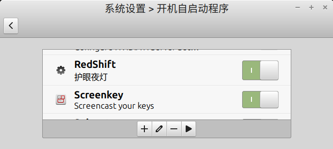

# {{ $frontmatter.title }}

**Description：** {{ $frontmatter.description }}。

| 适用系统 | 类型 | 标签 |
| --- | --- | --- |
| {{ $frontmatter.os.join(', ') }} | {{ $frontmatter.category.join(', ') }} | {{ $frontmatter.tags.join(', ') }}

---

## 用法
Adjust the color temperature of a screen according to its surroundings.
  Note: Redshift does not support Wayland.
  More information: https://manned.org/redshift.

- 根据配置文件 `~/.config/redshift.conf` 调整屏幕色温
    ```bash
    redshift -P
    ```
    如果不加 `-P` 参数，每次使用 RedShift 的效果会叠加，导致显示的色调可能极端得冷或暖。`-P` 参数可以清除上次使用 RedShift 的效果。
- Turn on Redshift with a specific temperature during day (e.g., 5700K) and at night (e.g., 3600K):
    ```bash
    redshift -t 5700:3600
    ```
- Turn on Redshift with a manually specified custom location:
    ```bash
    redshift -l latitude:longitude
    ```
- Turn on Redshift with a specific screen brightness during the day (e.g, 70%) and at night (e.g., 40%):
  redshift -b 0.7:0.4
- Turn on Redshift with custom gamma levels (between 0 and 1):
    ```bash
    redshift -g red:green:blue
    ```
- Purge existing temperature changes and set a constant unchanging color temperature in one-shot mode:
    ```bash
    redshift -PO temperature
    ```

## 配置
`~/.config/redshift.conf` 文件：
```ini
[redshift]
temp-day=5500               # 白天色温
temp-night=3500             # 夜晚色温
location-provider=manual    # 手动配置位置

[manual]
lat=32                      # 纬度
lon=118                     # 经度
```

## 开机自启动
我尝试做成用户级服务，但总是不生效，于是在桌面环境（Cinnamon）的设置中将 RedShift 添加到开机自启动，本质上就是在 `~/.config/autostart/` 目录下添加了 `redshift.desktop` 文件，内容如下：
```ini
[Desktop Entry]
Type=Application
Exec=/usr/bin/redshift -P
Hidden=false
Name[zh_CN]=RedShift
Name=RedShift
Comment[zh_CN]=护眼夜灯
Comment=护眼夜灯
X-MATE-Autostart-Delay=3
```
