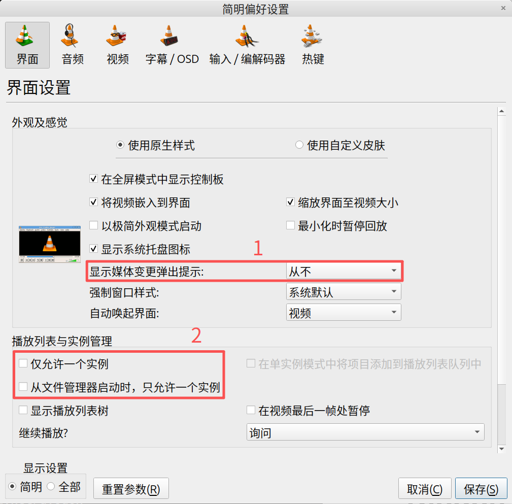

# {{ $frontmatter.title }}

**Description：** {{ $frontmatter.description }}。

| 适用系统 | 类型 | 标签 |
| --- | --- | --- |
| {{ $frontmatter.os.join(', ') }} | {{ $frontmatter.category.join(', ') }} | {{ $frontmatter.tags.join(', ') }}

---

```bash
sudo apt install vlc
```

设置：工具 -> 偏好设置


说明：
1. 建议设为“从不”。每次放完之后就弹通知，很烦人！！！
2. 建议都取消勾选，否则不能做到同时播放多个音频。