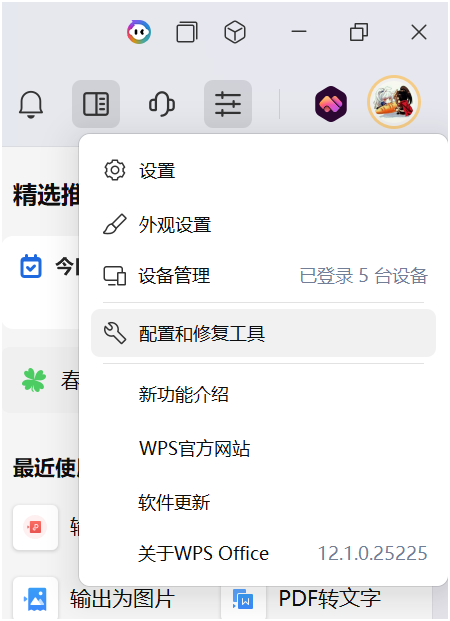

# {{ $frontmatter.title }}

[官网](https://github.com/tldr-pages/tldr)

**Description：** {{ $frontmatter.description }}。

| 适用系统 | 类型 | 标签 |
| --- | --- | --- |
| {{ $frontmatter.os.join(', ') }} | {{ $frontmatter.category.join(', ') }} | {{ $frontmatter.tags.join(', ') }}

---

## Windows 中 WPS 抢默认方式解决办法
https://zhuanlan.zhihu.com/p/693754129

其中有一条神评论，解决了找不到WPS配置工具的问题，如下。

